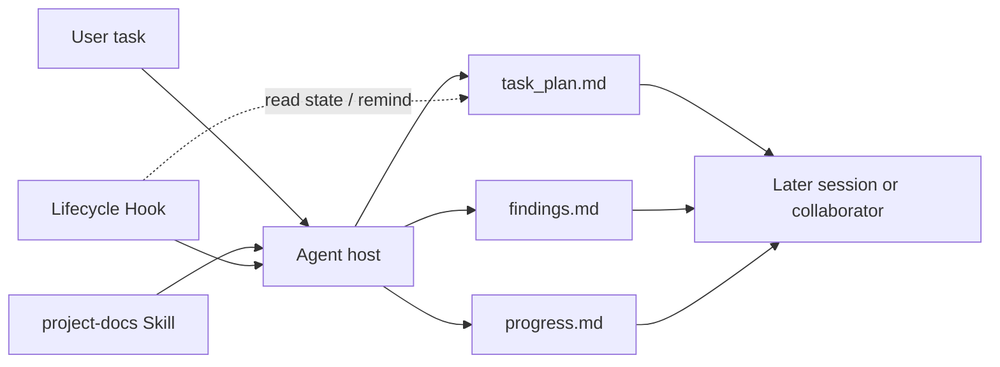

[简体中文](README.md) | [English](README.en.md)

# PlanWeft

Readable, resumable, and verifiable project records for coding-agent work.

PlanWeft keeps task plans, findings, and validation results in project files. Later sessions and collaborators can continue from those records instead of relying on old chat.

## Why PlanWeft

An agent's conversation ends before the work necessarily does. PlanWeft uses project-owned records to preserve the work: the Skill guides how the agent uses those records, Hooks read state or provide reminders at lifecycle events supported by the host, and project files hold the information needed for continuation.

## Install

Node.js 22 or newer is required. For a complete Codex integration:

```bash
npx planweft@0.7.0 add -a codex --global
npx planweft@0.7.0 doctor -a codex --global
```

After installation, create a new session, explicitly invoke `$project-docs`, and confirm that the host discovered and enabled the expected resources. See the [installation guide](docs/installation.en.md) for other hosts, scopes, and Skill-only installation.

## What using it looks like

For example, in a fresh Codex session:

```text
$project-docs
Fix the crash caused by empty rows in CSV import, add a regression test, and update the affected usage guide.
```

For a complex task that needs persistent planning, PlanWeft selects an existing plan or initializes task records within the authorized scope. A named plan normally lives under:

```text
your-project/
└── .planning/
    └── <date>-fix-csv-import/
        ├── task_plan.md
        ├── findings.md
        └── progress.md
```

The agent maintains these records during the task. A later session or collaborator can continue from the goal, current phase, findings, actual verification, and next action. Read-only requests and small changes do not require a new plan.

## What the agent gets after installation

Paths vary by host. This is a simplified view of a self-contained plugin package:

```text
planweft/
├── skills/
│   └── project-docs/
│       ├── SKILL.md              # core working rules
│       ├── references/           # detailed rules loaded as needed
│       ├── scripts/              # plan, check, and handoff helpers
│       └── templates/            # task-record templates
├── hooks/                        # host lifecycle adapters
├── extensions/ or commands/      # native host entry points, when applicable
└── package metadata              # discovery and version information
```

This tree describes package composition. It does not prove that a machine installed, trusted, or enabled the plugin, or that a model read the Skill.

## How the Skill, Hooks, and project records connect



The Skill decides how the agent works with records within authorization. A Hook can read state, inject context, or return host-permitted control output only at an event the host actually supports and enables. The three project records provide persistent task state.

## What the key files do

| File or component | When the agent encounters it | Role |
| --- | --- | --- |
| `skills/project-docs/SKILL.md` | After the host selects the Skill | Guides planning, investigation, implementation, verification, and handoff |
| `references/*.md` | When the Skill needs task-specific detail | Provides plan-selection, evidence, control, and documentation-map rules |
| `scripts/resolve-plan-dir.*` | When a complex task starts or resumes | Locates the task's plan directory |
| `scripts/init-session.*` | When new task records are authorized | Initializes `task_plan.md`, `findings.md`, and `progress.md` |
| `templates/*.md` | When records are initialized or extended | Provides record structure; it is not necessarily copied |
| Host Hooks or native extensions | During session, prompt, tool, compaction, or stop events | Reads plan state and supplies context or reminders |
| `task_plan.md` | Throughout the task | Holds the goal, phases, next step, blockers, and handoff decision |
| `findings.md` | During investigation and design | Holds sources, observations, assumptions, and candidate decisions |
| `progress.md` | During implementation and verification | Holds actions, errors, and `Passed` / `Failed` / `Not Run` results |

## What a task leaves behind

A complex task normally leaves three records in the project. They belong to the user's project, not to the plugin installation; updating or removing PlanWeft does not delete them. Existing requirements, design, and reproduction documents remain owned by the project.

```text
your-project/
├── <selected task directory>/
│   ├── task_plan.md
│   ├── findings.md
│   └── progress.md
└── <existing project documents>/
```

The Skill, Hooks, and documentation do not bypass project rules, user authorization, or host permissions.

## Supported hosts

The current npm package contains 15 host distribution targets. `codex`, `claude`, `pi`, `opencode`, and `dsh` are the primary supported integrations; the remaining targets are currently experimental adapters. Distribution does not mean that a host loaded the package or that a model used it. See [host support and boundaries](docs/hosts.en.md) for events, native entry points, and capability limits.

## Documentation

- [Install, update, roll back, and remove](docs/installation.en.md)
- [Architecture, lifecycle, and file responsibilities](docs/architecture.en.md)
- [Host distribution and capability boundaries](docs/hosts.en.md)

Maintainer material: [development and generation](docs/development.md) · [release and evidence maintenance](docs/releasing.en.md). Use the [documentation map](docs/README.md) to reach historical plans, reproductions, reviews, and references.
