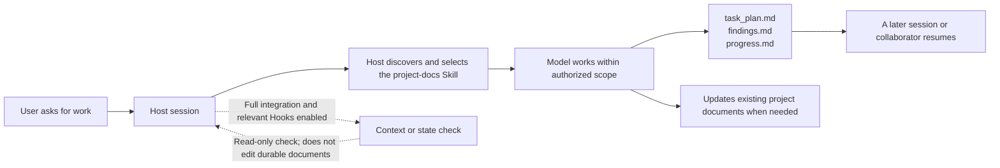

[简体中文](README.md) | [English](README.en.md)

# PlanWeft

**Keep a coding task readable, resumable, and reviewable after its chat session ends.**

PlanWeft keeps a coding agent's task plan, findings, and validation record in the project, so a later session or collaborator can resume without relying on old chat. The current source version is **0.5.1** (published to `next` and `latest`). It uses a pinned planning-with-files (PWF) v3.17.0 source, with `project-docs` Skill-managed document handoff and optional document-role mapping; Hooks still only read and report state. The formal promotion record is [REP-0015](docs/reproduction/0015-planweft-0.5.1-formal-promotion.md).

## Quick start

Node.js 22 or newer is required. Install and inspect the complete Codex integration with:

```bash
npx planweft@0.5.1 add -a codex --global
npx planweft@0.5.1 doctor -a codex --global
```

In a new session, invoke `$project-docs` explicitly and confirm that the agent actually reads the Skill. Installation record, host discovery, trust/enablement, current-session loading, Hook firing, and actual Skill reading are separate checks; `doctor` checks managed installation state only. See the [installation guide](docs/installation.en.md) for scope and loading on other hosts.

## What's inside

PlanWeft is one npm package: its installer deploys same-version resources in each host's layout, while task records always remain in the user's project. This tree is a guide to source and package layout, not evidence that a host loaded resources or a model read them.

```text
planweft/
├── bin/
│   └── planweft.mjs              # add / update / remove / list / doctor CLI
├── lib/
│   └── installer.mjs             # managed installation, rollback, host registration
├── overlays/planweft/            # reviewed shared source for generated output
│   ├── workflow.md               # project-docs workflow and document-handoff rules
│   ├── install/                  # bilingual install and host-specific guides
│   └── native/                   # Cursor, Copilot, Gemini, DSH, and other adapters
├── dist/
│   ├── manifest.json             # 15 distribution targets and file inventory
│   └── <host>/planweft/          # self-contained host package: Skill, assets, applicable bridge
├── docs/
│   ├── installation*.md          # install, update, rollback, removal
│   ├── how-it-works*.md          # tasks, Skill, Hook, and control boundaries
│   ├── platforms*.md             # support boundary and known limits
│   └── reference/runtime-map*.md # resources, event-by-event Hooks, 15-host matrix
├── scripts/
│   └── build-plugin.py           # rebuild managed distributions from overlays
├── tests/                        # installer, distribution, document, and adapter checks
└── package.json                  # npm entrypoint, version, public-file allowlist
```

### When to use each part

| You need to… | Start here | What it owns | What it does not prove |
| --- | --- | --- | --- |
| Install, update, remove, or diagnose | `bin/planweft.mjs` → `lib/installer.mjs` | Deploys managed resources, records installations, calls native registration | Does not execute a project task or verify model reading |
| Run a complex project task | `skills/project-docs/SKILL.md` | Guides the model to create/maintain task records and affected documents within authorized scope | A Skill file does not prove the current session read it |
| Use localized instructions | `skills/i18n/**` or portable language resources | Provides a language variant of the same main Skill | Not an independent or parallel workflow |
| Receive event context/reminders | Hook, plugin, or Extension under `dist/<host>/planweft/` | Reads state, injects context, or returns host-supported control output at supported events | A packaged file or manifest does not mean trusted, enabled, or live-accepted |
| Learn the model and boundaries | `docs/` | Public installation, runtime, platform, and evidence documentation | Documentation is not automatically injected runtime state |
| Change a distribution | `overlays/planweft/`, then the builder | Keeps source and every managed `dist/` package aligned | Do not hand-edit `dist/**` or `plugins/planweft/**` |
| Review a change | `tests/` and `npm run check` | Checks installer, distribution, and document contracts | Static tests do not replace live host loading or model-behavior acceptance |

### What a task leaves behind

A complex task normally uses these three project-owned records. They are not in the installation directory and are not removed by plugin updates or removal.

| File | Records | When to maintain it |
| --- | --- | --- |
| `task_plan.md` | Goal, phases, next action, blockers, evidence links, and `Documentation Handoff` | Before and after each phase |
| `findings.md` | Sources, observations, assumptions, and candidate decisions | During research, design, and evidence collection |
| `progress.md` | Actual actions, errors, and `Passed` / `Failed` / `Not Run` | During implementation and validation |

Durable requirements, architecture decisions, and reproduction materials stay in the project's existing specs, ADRs, and reproduction documents. A Documentation Map is human navigation only—not Hook input, cache, or a second state source.

## See a task leave useful records

This is an illustrative input, not a live host or model run from this repository:

```text
$project-docs
Fix the crash caused by empty rows in CSV import, add a regression test, and update the affected usage guide.
Keep the existing documentation layout and record actual validation results and unfinished work.
```



The Skill decides how to maintain project records and documents within authorized scope. At lifecycle points a host actually supports and enables, a Hook only reads state, injects context, or returns permitted control output. Neither bypasses project rules, user authorization, or host permissions. See [how it works](docs/how-it-works.en.md) and the [runtime reference](docs/reference/runtime-map.en.md).

## Support and verification boundary

| Scope | Current meaning |
| --- | --- |
| Distribution | `dist/manifest.json` lists 15 targets; a complete distribution does not give every host the same events, continuation, or permission model |
| Default behavior | Advisory; it does not guarantee task completion or correct documentation |
| Optional gated mode | Requests continuation only after explicit user activation, qualifying PWF conditions, and a host protocol that supports it; it does not replace testing or human review |
| Checks for every 0.5.x release | Rebuildable package, package static checks, Hook logic, Skill/Hook association, document-handoff marker, independent source review, and cold read |
| Work not executed | Marked `Not Run`; static manifest/source audit does not prove live host loading, model reading, or task behavior |

Attestation checks whether file contents changed; it does not prove human approval. Completion gates check plan state; they do not prove implementation correctness. Enable only one planning Hook implementation per session. The installer reports detectable duplicates but does not automatically remove other plugins. See [platform support](docs/platforms.en.md) and [SPEC-0006](docs/specs/0006-skill-hook-document-handoff.md) for the complete boundary.

## Documentation and verification entry points

- [Install, update, roll back, and remove](docs/installation.en.md)
- [How it works, directories, and controls](docs/how-it-works.en.md)
- [Runtime resources, Hooks, and document lifecycle](docs/reference/runtime-map.en.md)
- [Platform support and known limits](docs/platforms.en.md)
- [Development and generation](docs/development.md)
- [Release and evidence maintenance](docs/releasing.en.md)
- [Test entry points](tests/README.md)
- [Design-reference ledger](docs/design-references.md)

The project is distributed as one `planweft` npm package. The 0.4.0 release assets, exact archive digest, and acceptance records remain available from the [v0.4.0 GitHub Release](https://github.com/psiQAQ/planweft/releases/tag/v0.4.0).
