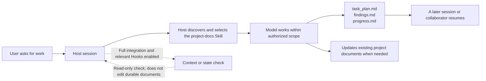

[简体中文](README.md) | [English](README.en.md)

# PlanWeft

**Keep a coding task readable, resumable, and reviewable after its chat session ends.**

PlanWeft keeps a coding agent's task plan, findings, and validation record in the project. A later session or collaborator can continue from those files without relying on chat history.

The current source version is **0.5.1 (published to `next` and `latest`)**. It uses a pinned planning-with-files (PWF) v3.17.0 source and adds optional document-role mapping alongside Skill-managed document handoff; Hooks still only read handoff state. The formal promotion record is [REP-0015](docs/reproduction/0015-planweft-0.5.1-formal-promotion.md).

## Quick start

Node.js 22 or newer is required. This example installs the complete Codex integration and checks its state:

```bash
npx planweft@0.5.1 add -a codex --global
npx planweft@0.5.1 doctor -a codex --global
```

In a new session, invoke `$project-docs` explicitly and confirm that the agent reads the Skill. See the [installation guide](docs/installation.en.md) for scope, trust, and loading details on other hosts.

First use has distinct checks: an installation record, host discovery, Skill reading in the current session, enabled Hooks, and the task records actually being created. `doctor` checks managed installation state; it cannot replace confirmation that the Skill was read in a new session.

## See a task leave useful records

This is an illustrative task input, not a real host or model run from this repository:

```text
$project-docs
Fix the crash caused by empty rows in CSV import, add a regression test, and update the affected usage guide.
Keep the existing documentation layout and record actual validation results and unfinished work.
```



The Skill guides model-side discovery, maintenance, and handoff. Hooks provide context or read state only at lifecycle points the host actually supports and enables. Neither bypasses project rules, user authorization, or host permissions. See [how it works](docs/how-it-works.en.md) and the [runtime reference](docs/reference/runtime-map.en.md) for the chain, directory ownership, and control boundaries.

## What it records

A complex task normally uses three working files:

| File | Contents |
| --- | --- |
| `task_plan.md` | Goal, phases, next action, and blockers |
| `findings.md` | Research, sources, assumptions, and open questions |
| `progress.md` | Actions taken, errors, and test results |

Durable requirements, design decisions, and reproduction material remain in the project's existing specs, ADRs, and reproduction documents. PlanWeft does not require a full document set for every small change, and it does not treat host chat history as the default recovery source.

An existing documentation index may optionally include a Markdown `Documentation Map` with document roles, actual locations, update triggers, and generated sources. It only guides the Skill within authorized scope: it requires no directory migration, is not parsed as state, does not read configuration or environment files, and does not affect Hooks. See the packaged `references/documentation-map.md` and [SPEC-0007](docs/specs/0007-document-role-map.md).

## 0.5.x validation boundary

| Capability | Status |
| --- | --- |
| Rebuildable package, package static checks, Hook logic, Skill/Hook association, and document-handoff marker | Required for each 0.5.x version |
| Independent source review and project-files-only cold read | Required for each 0.5.x version |
| 0.4.0 release acceptance | Historical evidence; not automatically transferred to 0.5.x |

Unrun checks are never reported as Passed. Document handoff is advisory by default; it reuses an existing PWF block budget only after the user explicitly enables gated mode and the original PWF conditions pass. Historical limits remain in their original records. See [SPEC-0006](docs/specs/0006-skill-hook-document-handoff.md) for the full boundary.

## Boundaries

- The default mode is advisory. It does not guarantee task completion. Autonomous/gated behavior requires explicit activation and depends on the host.
- Attestation checks file contents; it does not prove human approval. Completion gates check plan state; they do not prove correctness.
- Enable only one planning hook implementation in a session. The installer reports detectable duplicates but does not remove other plugins automatically.
- Updating or removing the plugin does not roll back or delete project plans, user notes, specs, ADRs, or reproduction records.

## Documentation

- [Install, update, roll back, and remove](docs/installation.en.md)
- [How it works, directories, and controls](docs/how-it-works.en.md)
- [Runtime resources and invocation boundaries](docs/reference/runtime-map.en.md)
- [Platform support and known limitations](docs/platforms.en.md)
- [Development and generation](docs/development.md)
- [Release and evidence maintenance](docs/releasing.en.md)
- [Test entry points](tests/README.md)
- [Design-reference ledger](docs/design-references.md)

The project is distributed as one `planweft` npm package. The 0.4.0 release assets, exact archive digest, and acceptance records remain available from the [v0.4.0 GitHub Release](https://github.com/psiQAQ/planweft/releases/tag/v0.4.0).
