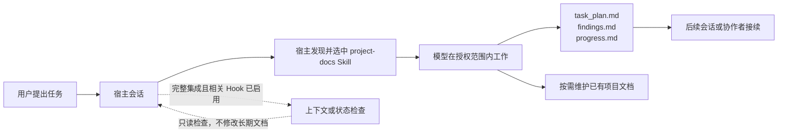

[简体中文](README.md) | [English](README.en.md)

# PlanWeft

**让编程任务在会话结束后，仍有可读、可接续、可核验的项目记录。**

PlanWeft 将编程 Agent 的任务计划、调查发现和验证记录保存在项目中；后续会话或协作者可从这些文件恢复工作，而非依赖旧聊天。当前源码版本为 **0.5.1**（已发布至 `next` 和 `latest`）。它基于固定的 planning-with-files（PWF）v3.17.0，并增加由 `project-docs` Skill 维护的文档交接与可选文档职责映射；Hook 仍只读提示状态。正式 promotion 记录见 [REP-0015](docs/reproduction/0015-planweft-0.5.1-formal-promotion.md)。

## 快速开始

需要 Node.js 22 或更高版本。以下为 Codex 完整集成的安装与检查：

```bash
npx planweft@0.5.1 add -a codex --global
npx planweft@0.5.1 doctor -a codex --global
```

新会话中显式调用 `$project-docs`，确认 Agent 实际读取了 Skill。安装记录、宿主发现、信任/启用、当前会话加载、Hook 触发和 Skill 实际读取是独立检查点；`doctor` 只检查受管安装状态。其他宿主的 scope 与加载方式见[安装指南](docs/installation.md)。

## 里面有什么

PlanWeft 是一个 npm 包：安装器按宿主布局部署同一版本的资源，项目内任务记录始终留在用户项目。下列目录树是源码与打包结构的导览，不是宿主已加载或模型已读取的证明。

```text
planweft/
├── bin/
│   └── planweft.mjs              # add / update / remove / list / doctor CLI
├── lib/
│   └── installer.mjs             # 受管安装、回退与宿主注册
├── overlays/planweft/            # 经审查的共享源码；生成产物的来源
│   ├── workflow.md               # project-docs 的工作流与文档交接规则
│   ├── install/                  # 中英文安装说明及宿主专项说明
│   └── native/                   # Cursor、Copilot、Gemini、DSH 等适配层
├── dist/
│   ├── manifest.json             # 15 个分发目标及逐文件摘要
│   └── <host>/planweft/          # 宿主自包含包：Skill、资源及适用的桥接器
├── docs/
│   ├── installation*.md          # 安装、更新、回退、卸载
│   ├── how-it-works*.md          # 任务、Skill、Hook 与控制边界
│   ├── platforms*.md             # 支持范围和已知限制
│   └── reference/runtime-map*.md # 资源、逐事件 Hook、15 宿主矩阵
├── scripts/
│   └── build-plugin.py           # 从 overlays 重建受管分发
├── tests/                        # 安装器、分发、文档和适配器检查
└── package.json                  # npm 入口、版本、公开文件白名单
```

### 各部分在什么时候使用

| 你要做什么 | 从哪里开始 | 它负责什么 | 不代表什么 |
| --- | --- | --- | --- |
| 安装、更新、删除或诊断 | `bin/planweft.mjs` → `lib/installer.mjs` | 部署受管资源、维护安装记录、调用原生注册 | 不执行项目任务，也不验证模型读取 |
| 在项目中处理复杂任务 | `skills/project-docs/SKILL.md` | 指导模型在授权范围内建立/维护任务记录与受影响文档 | Skill 文件存在不等于当前会话已读取 |
| 使用本地化说明 | `skills/i18n/**` 或便携包中的语言资源 | 为同一主 Skill 提供语言变体 | 不是独立或并行的工作流 |
| 在宿主事件取得提醒/上下文 | 各 `dist/<host>/planweft/` 的 Hook、插件或扩展 | 在该宿主支持的事件读状态、注入上下文或返回控制结果 | 打包文件或 manifest 不等于已信任、启用或实机验收 |
| 阅读工作原理与能力边界 | `docs/` | 提供公开安装、运行时、平台和验证资料 | 文档不是自动注入的运行时状态 |
| 修改分发内容 | `overlays/planweft/` 后运行构建器 | 保持源码与所有受管 `dist/` 包一致 | 不应手工编辑 `dist/**` 或 `plugins/planweft/**` |
| 复核改动 | `tests/`、`npm run check` | 覆盖安装器、分发与文档约定 | 静态测试不代替真实宿主加载或模型行为验收 |

### 一个任务留下什么

复杂任务通常使用下列三份项目拥有的记录；它们不属于安装目录，更新或卸载插件也不会删除它们。

| 文件 | 记录内容 | 何时维护 |
| --- | --- | --- |
| `task_plan.md` | 目标、阶段、下一步、阻塞、证据链接和 `Documentation Handoff` | 每个阶段前后 |
| `findings.md` | 来源、观察、假设和候选决定 | 调查、设计和证据收集时 |
| `progress.md` | 实际动作、错误和 `Passed` / `Failed` / `Not Run` | 实施与验证过程中 |

稳定需求、架构决定和复现材料仍在项目已有的 specs、ADR 与 reproduction 文档中。Documentation Map 仅作人工导航，不是 Hook 输入、缓存或第二状态源。

## 看一次任务如何留下记录

以下是说明性输入，不是本仓库的真实宿主或模型运行记录：

```text
$project-docs
修复 CSV 导入时空行导致的崩溃，补回归测试，并更新受影响的使用说明。
保留现有文档目录，记录实际验证结果和未完成事项。
```



Skill 决定如何在授权范围内维护项目记录与文档；Hook 仅在宿主实际支持且启用的生命周期点读取状态、注入上下文或返回允许的控制结果。二者都不绕过项目规则、用户授权或宿主权限。细节见[工作原理](docs/how-it-works.md)和[运行时参考](docs/reference/runtime-map.md)。

## 支持与验证边界

| 范围 | 当前含义 |
| --- | --- |
| 分发 | `dist/manifest.json` 列出 15 个目标；完整分发不等于每个宿主具有相同事件、续跑或权限能力 |
| 默认行为 | advisory；不自动保证任务完成或文档已经正确 |
| 可选 gated | 仅在用户显式启用、PWF 条件满足且宿主协议支持时请求继续；不代替测试或人工评审 |
| 每个 0.5.x 版本的检查 | 可重建包、包静态检查、Hook 逻辑、Skill/Hook 关联、文档交接 marker、独立源码审查与冷读 |
| 未执行的工作 | 标为 `Not Run`；静态 manifest/源码审计不能证明真实宿主加载、模型读取或任务行为 |

attestation 检查文件内容是否变化，不代表人工批准；完成门禁检查计划状态，不代表实现正确。同一会话只应启用一套规划执行 hooks；安装器会报告可检测的重复来源，但不会自动删除其他插件。完整支持范围和限制见[平台文档](docs/platforms.md)及 [SPEC-0006](docs/specs/0006-skill-hook-document-handoff.md)。

## 文档与验证入口

- [安装、更新、回退与卸载](docs/installation.md)
- [工作原理、目录与用户控制](docs/how-it-works.md)
- [运行时资源、Hook 与文档生命周期](docs/reference/runtime-map.md)
- [平台支持和已知限制](docs/platforms.md)
- [开发与生成约定](docs/development.md)
- [发布与证据维护](docs/releasing.md)
- [测试入口](tests/README.md)
- [设计来源台账](docs/design-references.md)

项目通过一个 `planweft` npm 包分发。0.4.0 的发布附件、准确归档摘要和验收记录仍见 [v0.4.0 GitHub Release](https://github.com/psiQAQ/planweft/releases/tag/v0.4.0)。
