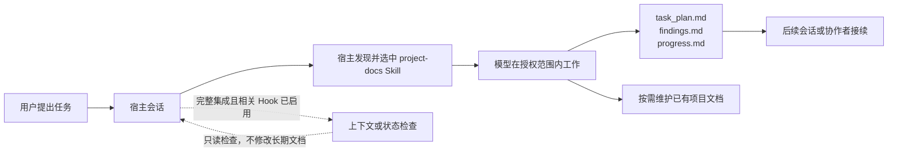

[简体中文](README.md) | [English](README.en.md)

# PlanWeft

**让编程任务在会话结束后，仍有可读、可接续、可核验的项目记录。**

PlanWeft 把编程 Agent 的任务计划、调查发现和验证记录保存在项目中。会话中断或换人后，可以从这些文件继续工作，而不必依赖聊天记录。

当前源码版本为 **0.5.1（已发布至 `next` 和 `latest`）**。它基于固定的 planning-with-files（PWF）v3.17.0，并由 `project-docs` Skill 管理文档交接及可选的文档职责映射；Hook 仍只读提示交接状态。正式 promotion 记录见 [REP-0015](docs/reproduction/0015-planweft-0.5.1-formal-promotion.md)。

## 快速开始

需要 Node.js 22 或更高版本。下面的例子为 Codex 安装完整集成，并检查安装状态：

```bash
npx planweft@0.5.1 add -a codex --global
npx planweft@0.5.1 doctor -a codex --global
```

新会话中显式调用 `$project-docs`，确认 Agent 实际读取了 Skill。其他宿主的 scope、信任和加载方式见[安装指南](docs/installation.md)。

首次使用时，安装记录、宿主发现、当前会话的 Skill 读取、Hook 启用，以及任务记录的实际创建是不同的检查点。`doctor` 检查受管安装状态，不能替代新会话中对 Skill 实际读取的确认。

## 看一次任务如何留下记录

这是一个说明性任务输入，不是本仓库的真实宿主或模型运行记录：

```text
$project-docs
修复 CSV 导入时空行导致的崩溃，补回归测试，并更新受影响的使用说明。
保留现有文档目录，记录实际验证结果和未完成事项。
```



Skill 指导模型怎样发现、维护和交接项目记录；Hook 只在宿主实际支持并启用的生命周期时点提供上下文或读取状态。两者都不绕过项目规则、用户授权或宿主权限。有关这条链路、目录所有权和控制边界，见[工作原理](docs/how-it-works.md)与[运行时参考](docs/reference/runtime-map.md)。

## 它保存什么

复杂任务通常使用三份工作文件：

| 文件 | 内容 |
| --- | --- |
| `task_plan.md` | 目标、阶段、下一步和阻塞项 |
| `findings.md` | 调研结果、来源、假设和待定事项 |
| `progress.md` | 已执行操作、错误和测试结果 |

稳定的需求、设计决定和复现材料继续保存在项目已有的 specs、ADR 和 reproduction 文档中。PlanWeft 不要求为每个小改动创建一整套文档，也不会把宿主聊天历史当作默认恢复来源。

已有的文档索引可以可选地加入一个 Markdown `Documentation Map`，说明文档职责、实际位置、更新触发条件和生成来源。它只帮助 Skill 在授权范围内导航：不要求迁移目录、不解析为状态、不读取配置或环境文件，也不影响 Hook。完整约定见随 Skill 分发的 `references/documentation-map.md` 与 [SPEC-0007](docs/specs/0007-document-role-map.md)。

## 0.5.x 验证范围

| 能力 | 状态 |
| --- | --- |
| 可重建包、安装包静态检查、Hook 逻辑、Skill/Hook 关联与文档交接 marker | 每个 0.5.x 版本的必需验证 |
| 独立源码审查与只接收项目文件的冷读 | 每个 0.5.x 版本的必需验证 |
| 0.4.0 发布验收 | 历史证据，适用范围不自动延伸至 0.5.x |

未执行验证不会写成 Passed。文档交接默认 advisory；只有用户明确启用 gated 且原 PWF 条件已满足时才复用既有 block 预算。0.4.0 的历史限制保留在其历史记录中。完整边界见 [SPEC-0006](docs/specs/0006-skill-hook-document-handoff.md)。

## 使用边界

- 默认模式提供提醒，不会自动保证任务完成。autonomous/gated 必须显式启用，并受宿主能力限制。
- attestation 检查文件内容是否变化，不代表人工批准；完成门禁检查计划状态，不代表实现正确。
- 模型范围遵循是公开评测结果，不是安全隔离保证。文件权限和命令授权仍由宿主负责。
- 同一会话只应启用一套规划执行 hooks。安装器会报告可检测的重复来源，但不会自动删除其他插件。
- 更新或卸载插件不会回退或删除项目计划、用户笔记、specs、ADR 和 reproduction。

## 文档

- [安装、更新、回退与卸载](docs/installation.md)
- [工作原理、目录与用户控制](docs/how-it-works.md)
- [运行时资源与调用边界](docs/reference/runtime-map.md)
- [平台支持和已知限制](docs/platforms.md)
- [开发与生成约定](docs/development.md)
- [发布与证据维护](docs/releasing.md)
- [测试入口](tests/README.md)
- [设计来源台账](docs/design-references.md)

项目通过一个 `planweft` npm 包分发。0.4.0 的发布附件、准确归档摘要和验收记录仍见 [v0.4.0 GitHub Release](https://github.com/psiQAQ/planweft/releases/tag/v0.4.0)。
