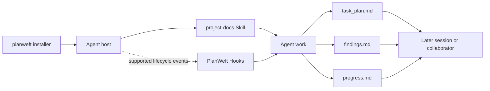
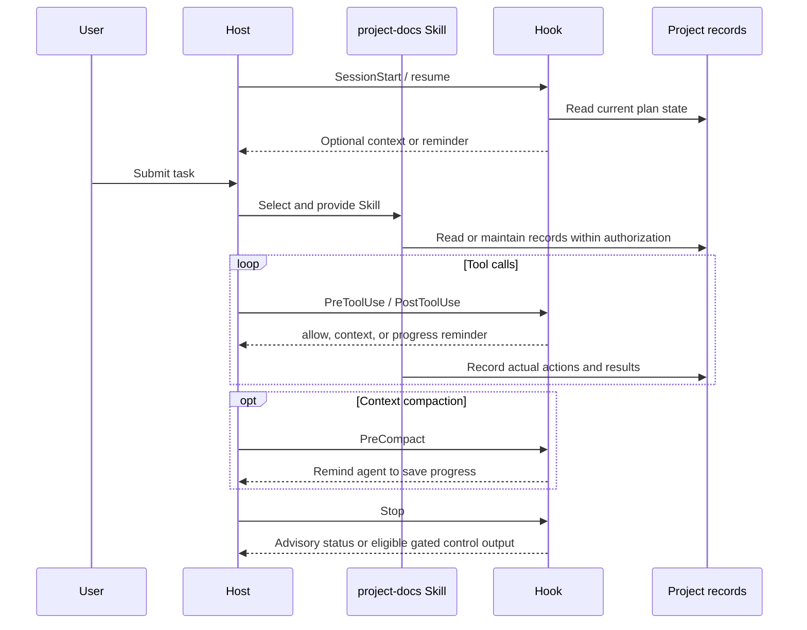

[简体中文](architecture.md) | [English](architecture.en.md)

# PlanWeft architecture

PlanWeft keeps the dynamic state of agent work in project files. The installer deploys resources, the host discovers, trusts, and enables them, the Skill guides the agent, and Hooks participate only in lifecycle events supported by that host.

## Runtime model



This is a source and distribution relationship diagram, not a live loading trace from a particular machine. Installation, host discovery, trust, enablement, current-session loading, and model reading must be checked separately.

## Skill and Hook boundaries

| Part | Responsibility | Does not mean |
| --- | --- | --- |
| `skills/project-docs/SKILL.md` | Guides the agent through plan selection, investigation, implementation, verification, and document handoff | It cannot bypass project rules, user authorization, or host permissions |
| `references/*.md` | Supplies detailed plan-selection, evidence, control, and documentation-map rules as needed | It is not a second state source or independent workflow |
| `templates/*.md` | Provides task-record structure | Every task will copy a template |
| Hook or native host extension | Reads state, injects context, or provides reminders at supported and enabled events | It normally does not edit durable documents or prove correctness |
| `document-handoff-check.sh` | Reads the selected plan's handoff section and returns a status | It does not edit documents or judge their quality |

Default behavior is advisory. Autonomous/gated behavior requires explicit activation and remains constrained by host protocol, the underlying PWF conditions, and user authorization.

## One agent lifecycle

1. The installer selects a host layout and records the managed installation.
2. The host discovers, trusts, and enables the plugin or Skill according to its own rules.
3. The agent session selects `project-docs`, which supplies the working rules.
4. A complex task selects or initializes task records within authorized scope.
5. The agent maintains the three project records during implementation and verification, and updates existing requirements, design, or reproduction documents only when authorized and affected.
6. Hooks read state and provide host-permitted output at available session, prompt, tool, compaction, or stop events.
7. A later session or collaborator reads the project records to recover the goal, phase, evidence, and next step.

Codex follows the static event sequence below. Other hosts use native entry points described in the [host guide](hosts.en.md).



## The three persistent records

| File | Main contents | Maintained when |
| --- | --- | --- |
| `task_plan.md` | Goal, phases, next step, blockers, evidence links, and `Documentation Handoff` | At task start, phase changes, and handoff |
| `findings.md` | Sources, observations, assumptions, and candidate decisions | During investigation, design, and evidence collection |
| `progress.md` | Actual actions, errors, and `Passed` / `Failed` / `Not Run` | During implementation and verification |

These files belong to the project, not the plugin installation. Updating or removing PlanWeft does not delete them or roll back existing project documents.

```text
your-project/
├── <selected task directory>/
│   ├── task_plan.md
│   ├── findings.md
│   └── progress.md
└── <existing specs, designs, and reproductions>/
```

Read-only tasks and small changes do not require a new plan. `docs/README.md` is human navigation, not Hook input, a cache, an approval record, or a second state source.

## What the package layers do

| Layer | Typical contents | Meaning for the agent |
| --- | --- | --- |
| Shared Skill | `skills/project-docs/SKILL.md` | Core working rules and task-record protocol |
| Skill resources | `references/`, `templates/`, `scripts/` | On-demand detail, structure, and read-only helpers |
| Host entry points | `hooks/`, `extensions/`, `commands/` | Connect shared behavior to a host lifecycle |
| Installer | `bin/planweft.mjs`, `lib/installer.mjs` | Installs, updates, rolls back, removes, and diagnoses managed resources |
| Distribution package | `dist/<host>/planweft/` | Self-contained host output generated from source |

Source lives under `overlays/planweft/`; generated directories are maintained by the builder. Source presence or a manifest entry does not mean that a host loaded the resource.

## Evidence boundary

Static source, manifests, Hook configuration, and generated diffs can establish distribution claims and code paths. They cannot by themselves establish that:

- a host discovered, trusted, or enabled the plugin;
- the current session loaded the expected version;
- a model read or followed the Skill;
- the host accepted a Hook result; or
- a task, code change, or document is correct.

When those conclusions matter, record the environment, inputs, outputs, and validation status separately. Keep unrun checks as `Not Run`; historical acceptance results do not automatically extend to the current version.

Start with the [installation guide](installation.en.md), then read the [host guide](hosts.en.md) for the relevant host.
