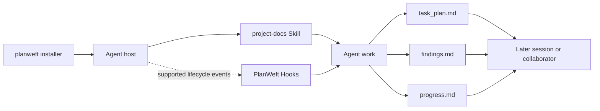
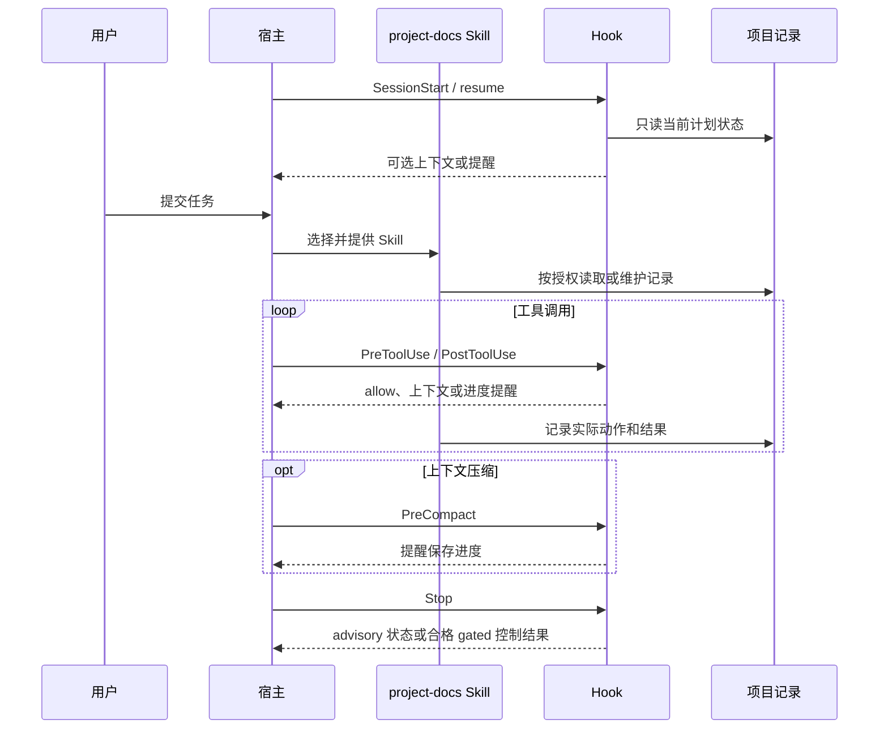

[简体中文](architecture.md) | [English](architecture.en.md)

# PlanWeft 架构

PlanWeft 的核心是把 Agent 任务的动态状态保存到项目文件中。安装器负责部署资源，宿主负责发现、信任和启用资源，Skill 指导 Agent，Hook 参与宿主支持的生命周期事件。

## 运行模型



这是一张源码和分发关系图，不是某台机器的实机加载追踪。安装、宿主发现、信任、启用、当前会话加载和模型读取必须分别核对。

## Skill 与 Hook 的边界

| 部分 | 负责什么 | 不负责什么 |
| --- | --- | --- |
| `skills/project-docs/SKILL.md` | 指导 Agent 判断是否需要计划、记录调查、实施、验证和文档交接 | 不绕过项目规则、用户授权或宿主权限 |
| `references/*.md` | 按任务提供计划选择、证据、控制和文档导航的详细规则 | 不构成第二套状态或独立工作流 |
| `templates/*.md` | 提供任务记录结构 | 不代表每次任务都会复制模板 |
| Hook 或宿主原生扩展 | 在宿主支持且启用的事件中读取状态、注入上下文或提供提醒 | 默认不修改长期文档，也不证明任务正确 |
| `document-handoff-check.sh` | 只读取选定计划的交接段并返回状态 | 不编辑文档，不判断内容质量 |

默认行为是 advisory。autonomous/gated 需要显式启用，并且仍受宿主协议、原 PWF 条件和用户授权限制。

## 一次 Agent 生命周期

1. 安装器按宿主选择对应的包布局并记录受管安装。
2. 宿主按自身规则发现、信任并启用插件或 Skill。
3. Agent 会话选择 `project-docs`；Skill 提供工作规则。
4. 复杂任务在授权范围内选择或初始化任务记录。
5. Agent 在实施、工具调用和验证过程中维护三份项目记录；需要时更新已有需求、设计或复现文档。
6. Hook 在可用的会话、提示词、工具、压缩或结束事件中读取状态并提供宿主允许的结果。
7. 后续会话或协作者读取项目记录，恢复目标、当前阶段、证据和下一步。

Codex 的静态事件顺序如下；其他宿主使用各自的原生入口，详见[宿主说明](hosts.md)。



## 三份持久记录

| 文件 | 主要内容 | 维护时机 |
| --- | --- | --- |
| `task_plan.md` | 目标、阶段、下一步、阻塞、证据链接和 `Documentation Handoff` | 任务开始、阶段变化和交接前后 |
| `findings.md` | 来源、观察、假设和候选决定 | 调查、设计和证据收集 |
| `progress.md` | 实际动作、错误和 `Passed` / `Failed` / `Not Run` | 实施和验证 |

这些文件属于项目，不属于插件安装目录。更新或卸载 PlanWeft 不会删除它们，也不会回滚项目已有文档。

```text
your-project/
├── <selected task directory>/
│   ├── task_plan.md
│   ├── findings.md
│   └── progress.md
└── <existing specs, designs, and reproductions>/
```

只读任务和简单修改不需要新建计划。`docs/README.md` 是人工导航，不是 Hook 输入、缓存、审批记录或第二状态源。

## 包中各层的作用

| 层 | 典型内容 | 对 Agent 的意义 |
| --- | --- | --- |
| 共享 Skill | `skills/project-docs/SKILL.md` | 核心工作规则和任务记录协议 |
| Skill 资源 | `references/`、`templates/`、`scripts/` | 按需提供细节、结构和只读辅助操作 |
| 宿主入口 | `hooks/`、`extensions/`、`commands/` | 把共享能力接入具体宿主生命周期 |
| 安装器 | `bin/planweft.mjs`、`lib/installer.mjs` | 部署、更新、回退、卸载和诊断受管资源 |
| 分发包 | `dist/<host>/planweft/` | 每个宿主的自包含输出；由源码生成 |

源码位于 `overlays/planweft/`，生成目录由 builder 维护。源码存在或 manifest 列出资源，不等于宿主已经加载资源。

## 证据边界

静态源码、manifest、Hook 配置和生成差异可以证明分发声明与代码路径，但不能单独证明：

- 宿主发现、信任或启用了插件；
- 当前会话加载了期望版本；
- 模型实际读取或遵循 Skill；
- Hook 返回结果被宿主接受；
- 任务、代码或文档已经正确。

需要这些结论时，应分别记录实际环境、输入、输出和验证状态。未执行的检查保持 `Not Run`，历史版本的验收结果不自动延伸到当前版本。

下一步：先看[安装指南](installation.md)，再按宿主阅读[宿主说明](hosts.md)。
