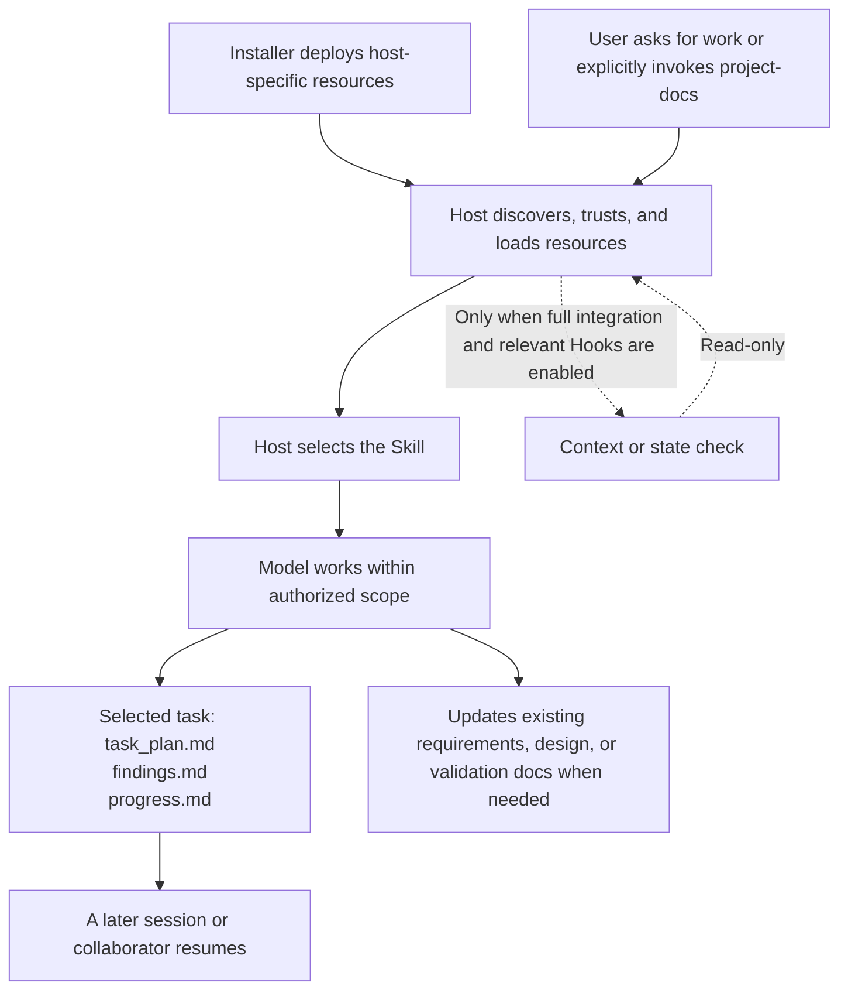

[简体中文](how-it-works.md) | [English](how-it-works.en.md)

# How PlanWeft works

PlanWeft keeps the current plan, findings, and actual validation of a complex coding task in project files. It is not another task executor: the model still works within user authorization, project rules, and host permissions.

## From a task to a later handoff



This is a source-level relationship diagram, not a trace of a live load or model run. Hosts differ in discovery, trust, lifecycle events, and permissions; see [platform support](platforms.en.md).

### Skill and Hook have different jobs

| Part | What it does | What it does not prove |
| --- | --- | --- |
| `project-docs` Skill | Guides the model to discover relevant entry points, maintain one task state, and decide whether existing documents need authorized updates | A Skill file does not prove that the current session read it or that the model followed it |
| Host Hook | Supplies context, checks plan state, or checks the handoff marker at events the host supports and enables | A Hook does not automatically edit durable documents or prove correctness or human approval |
| `document-handoff-check.sh` | Reads the handoff section in the selected task plan and classifies it as `pending`, `not_required`, or `complete` | It does not write project documents or validate that their contents are correct |

The default mode is advisory. Gated behavior reuses an existing completion gate only when the user explicitly enables it and the original PWF conditions and host capability pass; it still does not replace code tests or human review.

## Two kinds of files—keep them separate

### Installer-owned files

This is a simplified global POSIX-default data root. `PLANWEFT_HOME`, XDG settings, and the platform can change the root; it is not a guarantee of the host's final execution location.

```text
~/.local/share/planweft/
├── installations.json       # Installation scope, managed items, registration records
├── versions/
│   └── <version>/           # Receipt, lockfile, and the exact npm package
└── registries/
    └── codex/
        ├── .agents/plugins/marketplace.json
        └── payload/         # Copied self-contained Codex distribution
```

The installer manages these files and host registration. A full Codex marketplace installation uses a copied payload; do not infer that all full host installs are symlinks from support for `--symlink`. Removal deletes managed registration and payload while retaining the version store for rollback.

### Project-owned records

```text
your-project/
├── <selected task directory>/
│   ├── task_plan.md         # Goal, phases, next action, blockers, handoff decision
│   ├── findings.md          # Research, sources, assumptions, open questions
│   └── progress.md          # Actual actions, errors, validation results
└── <existing project documentation>/
    ├── requirements or specs
    ├── design decisions
    └── reproduction or validation records
```

These are document roles, not a required directory scaffold created at installation. Existing selection rules choose the task directory; small edits and read-only requests do not need a new plan. Updating or removing the plugin does not roll back or delete project records and user documents.

## Check first activation deliberately

1. The installer records the intended host and scope.
2. The host discovers, trusts, and enables the resource as required.
3. The current session loads the expected version.
4. Relevant Hooks are enabled, when the host has a full integration.
5. The model actually reads the main Skill.
6. An authorized complex task creates the expected project records.
7. A later session can recover the correct state and next action from project records alone.

Those checks are independent. `doctor` is for installation diagnostics; it cannot substitute for steps 5 through 7. See the [runtime reference](reference/runtime-map.en.md) for a readable resource and invocation map.

## An illustrative task

```text
$project-docs
Fix the crash caused by empty rows in CSV import, add a regression test, and update the affected usage guide.
Keep the existing documentation layout and record actual validation results and unfinished work.
```

Observable evidence would include task selection, real excerpts from the three records, code or documentation diffs, commands actually run and their results, and a new-session handoff without the old chat. The input above is documentation only; it does not claim that PlanWeft has completed live host/model validation for this scenario.
