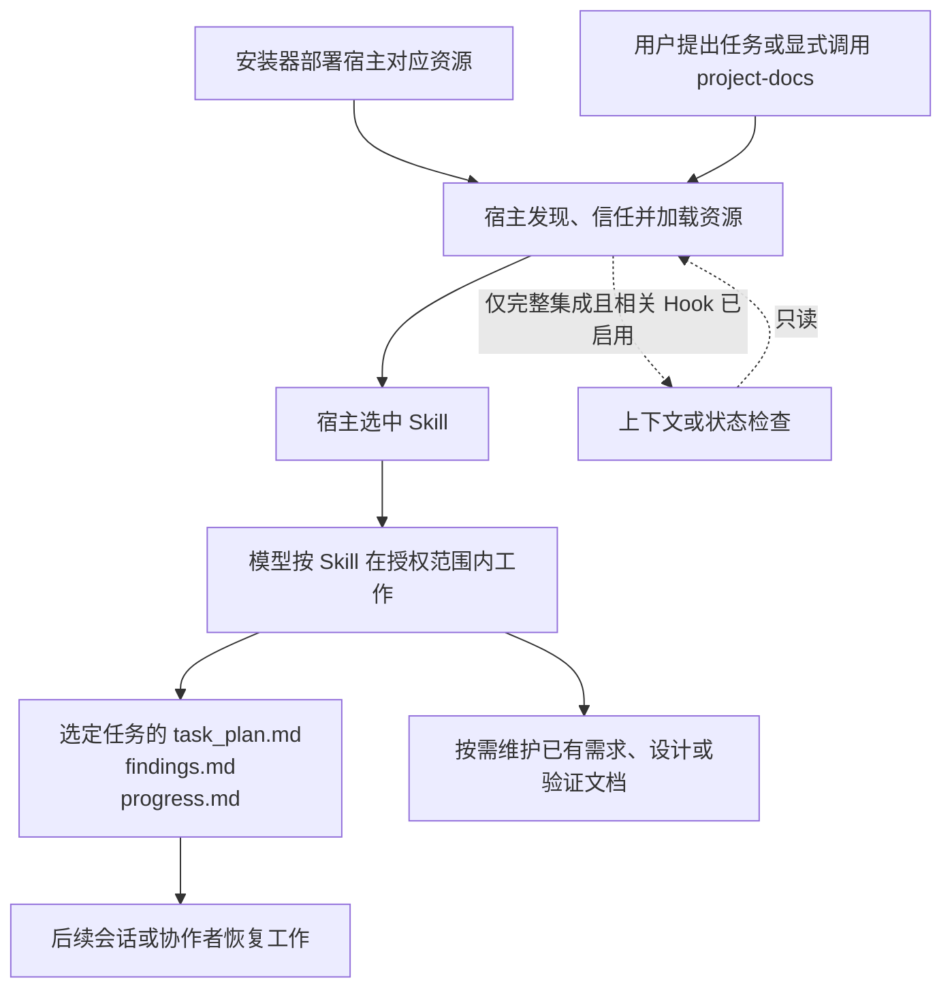
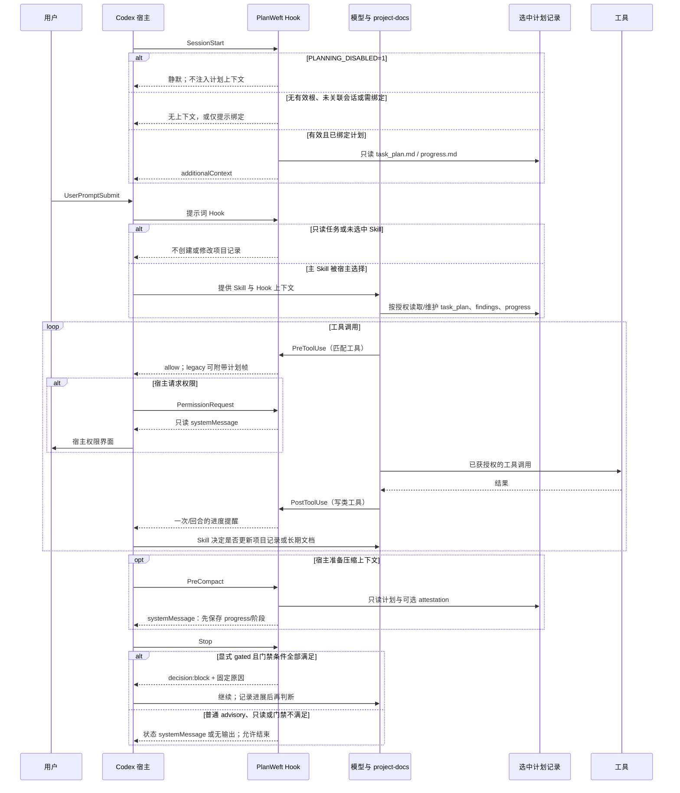

[简体中文](how-it-works.md) | [English](how-it-works.en.md)

# PlanWeft 如何工作

PlanWeft 让复杂编程任务把当前计划、调查发现和实际验证保留在项目文件中。它不是另一个任务执行器：模型仍在用户授权、项目规则和宿主权限之内工作。

## 从任务到接续



这张图是源码关系图，不是一次实机加载或模型运行的追踪记录。不同宿主的发现、信任、生命周期事件和权限模型不同；支持范围见[平台文档](platforms.md)。

### Skill 与 Hook 的分工

| 部分 | 做什么 | 不代表什么 |
| --- | --- | --- |
| `project-docs` Skill | 指导模型发现相关入口、维护一个任务状态，并在授权范围内决定是否更新已有文档 | Skill 文件存在不等于当前会话已经读取或模型一定遵循 |
| 宿主 Hook | 在宿主支持且启用的事件中提供上下文、检查计划状态或交接 marker | Hook 不自动修改长期文档，也不证明任务正确或已经人工批准 |
| `document-handoff-check.sh` | 只读取选定任务计划中的交接段，分类为 `pending`、`not_required` 或 `complete` | 它不写项目文档，也不验证文档内容正确 |

默认模式是 advisory。只有用户明确启用、且原 PWF 条件和宿主能力都满足时，gated 行为才复用已有的完成门禁；它仍不代替代码测试或人工评审。

## Codex 对话循环（静态源码路径）

此图对应 Codex 分发的 `codex-hooks.json` 和 `.codex/hooks/`。它显示事件可参与的次序，不证明当前机器已安装、信任、启用或实际读取了 Skill。图中的“维护”均受用户授权和项目规则约束。



其中 `PLANNING_DISABLED=1` 必须在会话启动前设置；它不会撤销已经发生的调用。无有效/已绑定计划时 Hook 不会猜测任务意图，Skill 也不会仅因一个 Hook 提醒而获得写入授权。普通 advisory 只提供上下文或提醒；显式 gated 仅在 Stop 条件满足且宿主协议支持时请求继续。

### 文档维护生命周期

1. `task_plan.md` 是当前任务的动态状态：目标、阶段、下一步、阻塞、证据链接和唯一的 `Documentation Handoff`。
2. `findings.md` 记录来源、观察、假设和候选决定；`progress.md` 记录实际动作、错误和验证结果。
3. 主 Skill 在授权范围内更新这三份记录，并且只在任务确有影响时维护已有 specs、ADR、reproduction 或使用文档。
4. Documentation Map 只是人工导航；它不是 Hook 输入、缓存或第二状态源。语言变体是主 Skill 的本地化资源，也不构成并行工作流。

## 两类文件，不要混在一起

### 安装器拥有的文件

以下是全局 POSIX 默认数据根目录的简化示意。`PLANWEFT_HOME`、XDG 设置和平台会改变根路径；这不是宿主最终执行位置的保证。

```text
~/.local/share/planweft/
├── installations.json       # 安装 scope、受管项与注册记录
├── versions/
│   └── <version>/           # receipt、lockfile 与准确 npm 包
└── registries/
    └── codex/
        ├── .agents/plugins/marketplace.json
        └── payload/         # 复制出的自包含 Codex 分发目录
```

安装器管理这些文件及宿主注册。完整 Codex marketplace 安装使用复制的 payload；不要把 `--symlink` 支持理解为所有完整宿主安装都是符号链接。卸载会移除受管注册和 payload，但保留版本存储以支持回退。

### 项目拥有的记录

```text
your-project/
├── <选定的任务目录>/
│   ├── task_plan.md         # 目标、阶段、下一步、阻塞与交接判断
│   ├── findings.md          # 调查、来源、假设和待定项
│   └── progress.md          # 实际操作、错误和验证结果
└── <项目原有的文档位置>/
    ├── 需求或规格
    ├── 设计决定
    └── 复现或验证记录
```

这描述的是文档角色，不是安装后必然创建的目录脚手架。任务目录按既有选择规则确定；小修改和只读请求不需要新计划。插件更新或卸载不会回滚或删除项目记录和用户文档。

## 首次生效怎么核对

1. 安装器记录了对应宿主与 scope。
2. 宿主发现并按自身要求信任、启用了对应资源。
3. 当前会话加载了期望版本。
4. 相关 Hook 已启用（如果该宿主提供完整集成）。
5. 模型实际读取了主 Skill。
6. 一项已授权的复杂任务产生了预期的项目记录。
7. 后续会话能只凭项目记录恢复正确的状态和下一步。

这些检查彼此独立。`doctor` 用于安装诊断，不能替代第 5 至 7 项。一个可读的资源与调用边界表见[运行时参考](reference/runtime-map.md)。

## 一个说明性任务

```text
$project-docs
修复 CSV 导入时空行导致的崩溃，补回归测试，并更新受影响的使用说明。
保留现有文档目录，记录实际验证结果和未完成事项。
```

预期的可观察材料是任务选择、三份记录中的实际片段、代码或文档 diff、执行过的验证命令及结果，以及不给旧聊天记录时的新会话接续。上面的输入是文档示例，不是 PlanWeft 已在此场景完成真实宿主/模型验证的声明。
