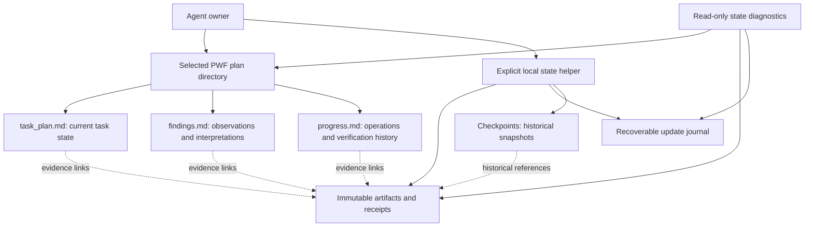

# SoL-Pi 思想移植：可恢复证据与长期任务状态实施计划

- 文档 ID：`PLAN-SOLPI-20260917`
- 编写日期：2026-09-17
- 调研基线：PlanWeft `46abb8fbca94abf3d46fd2500f105967d16a30f5`，该提交的 `package.json` 为 `0.5.1`。
- 外部参考基线：`NVlabs/SoL-Pi@2b791687a489a1d24da816cf1634d8ae1d36befd`。
- 文档性质：交给本地 Agent 的实施与发布设计输入；本文不表示功能已经实现、测试已经通过或发布已经完成。
- 本次提交范围：计划文档和文档导航；不修改运行时代码、固定上游、依赖、版本号、历史发布证据或 registry。
- 需求来源：用户要求将 SoL-Pi 思想结合 PlanWeft 写成详细计划，提交到 `docs/`，由本地 Agent 实现和发布。
- 动态状态：实施时使用选定的 PWF `task_plan.md`；本文保留范围、接口契约与验收标准，不成为第二份动态任务状态。

## 1. 执行入口与完成定义

本地 Agent 先阅读根 `AGENTS.md`、本文、[开发约定](../development.md)、[架构说明](../architecture.md)、[发布流程](../releasing.md)，再进入对应规范源。不要把历史计划中的阶段描述当作当前实现状态。

按 M0 → M1 → M2 → M3 → M4 → R0 完成第一批 P0；第一批稳定后再按 M5 → M6 → R1 完成 P1。M4 的评测基线应在 M1 改动前采集，不能到功能完成后才选择有利的任务。每阶段在唯一动态计划中记录输入提交、实际命令、结果、证据和下一步。

第一批交付应满足：在不替换宿主工具、不改动默认 advisory 行为的前提下，Agent 能在已授权任务目录保存原始证据，生成可校验收据，安全记录结果，识别损坏与不完整写入，并在下一会话恢复。安装检查与任务证据检查互不混淆。旧项目不启用新机制时仍按原工作流运行。

第二批交付应满足：在上述基础上，通过显式检查点缩减活动文档中的历史细节，保留未完成事项、约束和证据入口；提供经过原文核对的本地日志摘录，并用配对任务和消融实验说明有效范围。不得以缩短文档为由删掉约束、失败记录或必要验证。

本文中的路径和命令分为“现有”与“拟新增”。拟新增入口只有完成对应实现与测试后才能写入用户安装说明。遇到基线已变化时先做影响分析，不回退用户的新代码来迁就本计划。

## 2. 当前事实与必须保留的边界

下表对应调研基线，不代表所有宿主均经过真实会话验收。

| 已有事实 / 规范 | 核对入口 | 对本计划的约束 |
| --- | --- | --- |
| 单一 `project-docs` Skill，PWF 三文件保存任务状态 | `docs/architecture.md`、`overlays/planweft/entrypoints/zh.md` | 不新增平行规划 Skill、任务数据库或另一份当前状态 |
| 计划使用 `### Phase` 与 `**Status:** pending / in_progress / complete` | `overlays/planweft/entrypoints/zh.md`、`BUILD.md` | 不改成 `completed`，不破坏阶段计数、结束检查和旧模板 |
| 计划可为 `.planning/<id>/`，也可能为项目根目录旧布局 | `overlays/planweft/references/plan-selection.md` | 不假设所有宿主、Shell、PowerShell 初始化器行为相同 |
| `PLAN_ID`、`PWF_PLAN_ROOT` 等是现有绑定协议 | 同上 | 不清除被拒绝的绑定后偷偷选另一个计划；选择不明时禁止写入 |
| 根目录 `.planweft/` 已承载项目安装器状态 | `lib/installer.mjs` | 新证据不能直接放入此前讨论设想的根 `.planweft/artifacts/` |
| CLI 已有 `doctor`、`add`、`update`、`remove`、`list` | `bin/planweft.mjs`、`lib/installer.mjs` | 扩展诊断而不是另造同名安装器；旧命令含义和输出兼容 |
| Hook 默认 advisory，安装不等于加载、读取或遵循 | `docs/architecture.md` | Hook 不能凭存在即被标记为工作正常，也不能变成默认自动写入器 |
| 共享源码位于 overlays，由构建器生成各宿主包 | `docs/development.md`、`overlays/planweft/BUILD.md` | 不手改 `dist/**`、`plugins/planweft/**`；新共享资源也必须纳入生成 |
| 当前有离线测试、安装生命周期和发布证据体系 | `tests/README.md`、`docs/releasing.md` | 复用测试框架与状态语义，不另造绕过既有发布门禁的证明体系 |
| `docs/README.md` 仅人工导航 | `docs/README.md` | 新计划入口不能被 Hook 当作任务授权或当前计划 |

`BUILD.md`、历史规格、旧 release 文档中出现的旧版本和平台数量只说明当时状态。具体支持范围以实施时的源代码、当前 policy 和实际验证为准。

### 2.1 对前序讨论的设计修正

1. **收据可校验不等于结论正确。** SHA-256 证明保存的字节一致；逐字引用证明引文对应原文。它们不证明命令确实执行、日志完整、根因成立或验收标准已满足。
2. **退出码 0 不等于阶段完成。** 测试可被跳过、范围可能不全，结果也可能对应旧代码。只有明确的验收映射、适用的代码快照和必要 review 都满足时，owner 才能更新 `complete`。
3. **多个文件重命名不构成整个目录的原子事务。** 本计划采用单写者、写前检查、日志和恢复，称为“可恢复多文件更新”；不承诺无感知读者永远看不到中间状态。
4. **优化失败可退回旧工作流，但不能带错放行。** 归档失败时保留原始来源、不替换它；收据不完整时拒绝 `verified` 或自动完成。不得简单把所有失败统称为 fail-open。
5. **活动文档字节减少不等于模型 token 或费用下降。** 未读取的文件不消耗上下文；模型是否实际减少读取、是否增加 recall，要通过运行数据验证。
6. **“可恢复”有明确范围。** 本机原始文件存在不等于 Git clone 后或另一台机器上可用；本地证据、可共享证据及失效引用必须显式区分。

## 3. 取舍、优先级与非目标

| 来源思想 | PlanWeft 的移植形式 | 优先级 | 首批范围 |
| --- | --- | --- | --- |
| ObservationPack | 原始 Artifact + 小型引用 + 按需读取 | P0 | 显式输入的任务证据；不拦截全部宿主输出 |
| Evidence-Preserving Reducer | 可校验 Receipt；原文与解释分离 | P0 / P1 | P0 做原文绑定与结构校验，P1 做确定性摘录 |
| Action Fusion | 合并不需要新决策的证据记录与状态维护 | P0 | 显式记录助手与可恢复写入，不替换 `edit/write/bash` |
| Online Context Compact | 语义边界上的文件检查点 | P1 | 历史细节归档与活动文档缩减，不调用宿主 native compact |
| 默认关闭、失败回退 | 新能力显式启用，诊断说明降级原因 | P0 | 旧任务行为不变，不暗中扩大读写范围 |
| Auto-research 的实验方法 | 长任务基线、配对评测与消融 | 从 M0 开始 | 先证明状态正确性，再评估成本 |
| 复杂未来成本估计 | 基于真实 telemetry 的后续研究 | P2 | 本计划不实现 |

明确不做：替换或包装宿主核心工具；新建 Agent harness；自动执行收据中的命令；后台常驻服务；向量数据库；跨项目自动扫描；自动读取旧会话、认证或宿主配置；默认远程 reducer；跨 Agent 共用一份可并发写的动态计划；通用事件溯源数据库；为完整性预建全部未来接口。

远程 reducer、缓存经济模型、自动垃圾回收、多写者合并、跨机器证据同步属于后续独立设计，不是 P0/P1 的发布依赖。SoL-Pi 的性能数据不能移作 PlanWeft 的收益承诺。

## 4. 架构与权威来源



权威分工：`task_plan.md` 是当前阶段、阻塞和下一步的唯一动态状态；`findings.md` 保存当前仍相关的观察和解释；`progress.md` 保存实际动作记录；artifact 是字节证据；receipt 是有来源等级的证据描述；checkpoint 是历史快照；transaction journal 仅用于修复一次未完成写入。任何 index、缓存和诊断输出都不能反过来覆盖计划。

允许增加证据元数据，不允许在 sidecar 中再保存一套独立的 `current_phase`、任务完成布尔值或待办列表并与 Markdown 双向同步。查找索引必须可从 immutable records 重建，不是 P0 的必要组件。

### 4.1 数据目录

建议新增命名为 `.planweft-state/` 的**任务侧目录**。名称属于本计划的新约定，不是当前实现。由已解析的 `plan_dir` 定位，不能通过向上扫描任意目录猜测。

```text
<selected-plan-dir>/
├── task_plan.md
├── findings.md
├── progress.md
└── .planweft-state/
    ├── store.json
    ├── .gitignore
    ├── artifacts/
    │   └── sha256/<first-two-hex>/<full-sha256>
    ├── receipts/
    │   └── <receipt-id>.json
    ├── transactions/
    │   └── <transaction-id>/
    └── checkpoints/                 # P1
        └── <checkpoint-id>/
```

当 `plan_dir` 是项目根目录时，新目录为根 `.planweft-state/`，仍与安装器 `.planweft/` 分离。不要修改现有安装器的 `PLANWEFT_HOME`、安装收据和卸载规则来容纳项目证据。

M0 必须检查命名冲突。已有同名目录但无匹配 schema 与 owner identity 时拒绝采用，不覆盖、不清空、不自动迁移。`plan_dir` 必须位于本次授权项目内；外部合法工作目录需要明确授权，不由环境变量自行扩大范围。

只在显式启用后创建数据目录。`doctor`、`verify`、`recall` 及 `--dry-run` 不得因为缺目录而初始化。旧计划不启用时零迁移、零新文件。

### 4.2 持久性、隐私与共享

默认 store 为本地私有证据。经授权初始化时，在 store 内写入受管 `.gitignore`，默认忽略 store 数据；不替用户修改仓库全局 ignore，不自动 `git add`。已有被跟踪文件不会被 ignore 自动取消跟踪，必须诊断并报告。

POSIX 新敏感文件采用最小可用权限，Windows 检查实际访问边界；不能把 `chmod` 通过等同于 Windows ACL 验证。继承目录权限或文件系统特性使保护不足时应提示，不声称安全隔离。

活动文档中的本地引用标记 `Local-only`。跨机器交接前，owner 使用获授权的复制或导出流程，将需要的 receipt、artifact、checkpoint 依赖闭包放入明确共享位置，校验 hash，并更新共享引用。P0 不自动上传、不自动同步，不把缺原文的摘要包装为完整证据。

敏感证据不能因“完整保存”而强行落盘。若任务禁止持久化某输出，保留其受限状态，禁止生成宣称可恢复的压缩替代；对需要证据的验收项记 `Inconclusive` 或 `Not Run` 并说明原因。脱敏副本是新 artifact，记录 `derived_from` 与处理方式；不能沿用原始 hash 或宣称字节完全一致。

卸载和升级插件不得删除任务 store。P0/P1 不自动删除已被引用的 artifacts、receipts 或 checkpoints；磁盘额度不足时停止新增优化并给出提示。后续清理必须先做引用闭包与 dry-run，另行设计。

## 5. 核心数据契约

M0 将本节落实为 schema、正反例 fixture 和必要 ADR。以下是设计要求，不是已经发布的 schema。使用 JSON、UTF-8、显式 `schema_version`；拒绝未知主版本与会改变权限或路径解释的未知字段。诊断旧数据失败不等于可以重写它。

### 5.1 Store identity 与配置

`store.json` 至少包含 `schema_version`、随机生成并持久保留的 `store_id`、`plan_id` 或明确的 legacy 标识、创建时间、启用能力以及本地存储预算。项目授权仍来自用户与项目规则，不来自这个文件本身。

缺文件时全部新写入能力关闭。损坏配置或绑定不符时禁止写入，诊断返回原因。P0 仅允许本地证据与显式记录；checkpoint 是 P1 的独立 opt-in。P0/P1 不提供可被意外启用的远程 reducer 配置项。

同一个 store 移动工作区后不因绝对路径变化生成新身份；依靠相对路径和明确的重新绑定验证处理移动。复制 store 不代表复制运行授权。不要把当前机器绝对路径、用户名或完整环境写入可共享 identity。

### 5.2 Artifact

| 字段 / 规则 | 要求 |
| --- | --- |
| 内容地址 | `sha256` 为原始字节 SHA-256，完整 64 位十六进制；同 hash 复用前必须核验已存对象 |
| 写入 | 流式读取，临时文件位于同一 store 文件系统；写完、刷新、复核后再发布最终名称 |
| `bytes` | 原始字节长度，不是字符数、token 数或显示长度 |
| `media_type` / `encoding` | 明确 text、JSON 或 binary；文本编码不明时不得静默有损解码 |
| `capture_completeness` | `complete`、`truncated`、`unknown`；只按实际采集能力填写 |
| `origin` | 区分当前受控采集、既有文件导入和人工/模型转述；不升级来源等级 |
| 衍生关系 | 脱敏、去 ANSI、合并流、换行转换等均产生新 artifact，并指回原来源 |
| 同名冲突 | 已有对象长度/hash 不一致时视为损坏，拒绝覆盖并保留诊断证据 |

原始 stdout 与 stderr 能分别获取时分别保存。若宿主只提供合并流，记录合并事实，不伪造流间顺序。进程 timeout、signal、截断、解码失败均有明确状态。超大文件不能为得到短摘要而整个读入内存；遵守显式字节预算。

原始字节不改换行。文本行号按 LF 分行，1-based、闭区间；CR 字节仍属于原文。精确引用使用 UTF-8 编码后的字节区间，0-based、`[start_byte, end_byte)`。行号便于人读，字节区间与 hash 用于核对。Unicode、多字节字符和 CRLF 必须有 fixture。

### 5.3 Receipt

| 字段 | 含义与校验 |
| --- | --- |
| `schema_version`、`receipt_id` | 独立版本与唯一收据标识；同 ID 不同内容拒绝 |
| `store_id`、`plan_id` | 绑定所属 store 与任务，防止把别的任务证据混入 |
| `recorded_at` | UTC 时间，只表示记录时间，不冒充命令执行时间 |
| `producer` | helper/adapter/import/human 等来源及版本；这是 provenance，不是密码学身份证明 |
| `operation_id`、`idempotency_key` | 一次实际操作的身份；同 key 同输入复用，同 key 异输入冲突 |
| `execution` | 实际获取的 argv 或展示命令、相对 cwd、开始/结束时间、退出码、signal、timeout、采集方式；未知值为 null |
| `subject` | 证据适用对象：commit、dirty 标志、已授权相关文件摘要或测试输入身份；不凭 commit 忽略未提交变化 |
| `artifacts` | 相对路径、SHA-256、字节数、完整性及可用范围 |
| `excerpts` | 原始 artifact、字节区间、可选行范围、逐字引用及核对结果 |
| `observed_result` | `Passed`、`Failed`、`Inconclusive`、`Not Run`，与实际观察及来源等级一致 |
| `interpretation` | 人或模型的解释、假设及不确定性；与原文摘录分开 |
| `criteria` | 本次证据覆盖的验收项及未覆盖项；没有覆盖声明时不能自动完成阶段 |
| `supersedes` | 后续更正引用旧 receipt；不重写旧 receipt 的历史结论 |

命令字符串只作数据，**任何 reader、doctor、reducer 或 recovery 都不得执行它**。导入历史日志而无法证实命令执行事实时，标记 `reported/imported`；可以确认文件字节和原文摘录，不能由此生成新的本次执行 Passed。

结构校验、原文校验、运行结果和任务验收是四个独立概念。API 和 UI 不得用一个含义模糊的 `verified: true` 同时表示四者。建议诊断分别返回 `structure_check`、`source_check`、`execution_evidence`、`criteria_check`。

结果时效不单靠时间判断：测试后相关文件变化即需要适用性复核。无法确定影响范围时保守标记 stale/unknown，不自动复用。依赖、平台、测试配置影响结果时也属于适用条件。

### 5.4 活动文档中的短记录

下例只是格式示意，不是实际测试结果，也不是必需的新标题模板：

```text
Verification: <check-name> — Failed
Observed for: <commit/dirty snapshot or other subject>
Coverage: <criterion IDs>; not covered: <remaining criteria>
Evidence: .planweft-state/receipts/<id>.json (Local-only)
Key observation: <brief observation with source reference>
Interpretation: <hypothesis, explicitly separate from observation>
Next action: see task_plan.md
```

不把完整日志重复粘入三份记录。`progress.md` 不再复制当前阶段与待办；`findings.md` 不把假设升级为事实；`task_plan.md` 只维护当前决策必需状态与引用。

## 6. 写入协议：证据先行，可恢复而非虚构全局原子性

### 6.1 最小 P0 记录路径

第一步实现“保存 artifact → 校验并发布 immutable receipt → 返回短记录”。即使后续 Markdown 写入失败，已归档证据仍可找回；不得把数据目录存在当作记录成功。

随后实现显式 `record` 操作，接受已授权来源与 owner 提供的记录意图，不重新运行测试。一个请求可同时维护关联 Markdown，减少重复模型回合；是否修改 findings 或 phase 必须来自明确意图，不能由日志关键词自行决定。

第一版禁止根据 `exit_code == 0` 自动设置阶段 `complete`。如后续加入受限完成转换，必须有明确 criterion 映射、fresh evidence 和所有现存 handoff/gate 前提，且有单独测试。无需该转换即可发布 P0。

### 6.2 多文件更新步骤

1. 解析授权项目与已选计划，核对 `PLANNING_DISABLED`、只读模式、写入范围及配置。
2. 获取该 plan 的协作写锁。锁只协调采用本协议的 owner，不声称锁住编辑器、Git 或其他进程。
3. 读取目标文件及预期 hash。目标只允许已选三文件的明确块；拒绝任意路径、模糊全文替换和不支持的模板。
4. 归档并核验 artifacts；准备 immutable receipt。发生错误即停止，不删除原始输入。
5. 在 `transactions/<id>/` 保存 before/after hashes、必要 before image、待写内容和操作清单；不在 journal 中维护一套长期任务状态。
6. 写前再次确认目标仍等于 before image。按安全顺序逐文件替换；receipt 可恢复后才加入 Markdown 引用，阶段完成转换必须最后发生。
7. 回读所有写入，核对内容与引用，标记 journal committed；返回明确的 transaction ID 和实际修改列表。
8. 释放本次锁。可重建 staging 仅在不影响恢复时清理；不能顺带删除他人文件或证据。

原子 rename 的支持、文件刷新与断电恢复能力按操作系统和文件系统实测说明。禁止把一次正常运行通过表述为断电零丢失保证。不合作进程的并发改写与恶意文件系统竞争超出协作锁保证；检测到冲突就停，不盲目重试覆盖。

### 6.3 恢复与幂等

未完成 journal 被发现时，普通读取仍可查看原文，诊断明确报告 incomplete；新的冲突写入必须拒绝。显式 recovery 对每个目标比较 before / after / other 三态：全部 before 可取消；部分 after 可在无冲突时前滚或回滚；出现 other 必须保留用户内容并报告人工协调点。

rollback 是恢复本次写入，不是恢复整个 Git 工作区。不能 `git reset --hard`、清空计划目录或丢弃 worker 改动。相同请求重试不得生成重复 progress 条目；真正再次运行相同命令必须得到新的 operation identity，而不是被误去重。

只剩孤立 artifact/receipt 不等于任务失败，也不等于已完成写入。doctor 列出它们；P0 不自动垃圾回收。读取 journal 中的备份与恢复本身仍需要当前写入授权，旧事务不是新授权。

## 7. 诊断与可观察性

保留已有安装 `planweft doctor` 的行为。拟新增任务侧入口为 `planweft state doctor`，并从顶层 CLI **在构造 Installer 之前**分流，避免任务诊断顺带读取 `.planweft/installations.json`、宿主配置或执行宿主命令。

同一任务诊断核心也随 Skill 分发，供复制式或 Skill-only 安装调用。不要复制一套独立实现。

诊断至少区分：配置是否声明启用、相应资源是否存在、是否有本会话真实活动记录、指定检查是否通过。它们不是自动递进关系。缺 observation 时是 unknown/Not Run，不是 verified；关闭的可选能力是 disabled，不是 failure。

输出包含当前 plan/store identity、schema、启用能力、读写模式、最近 receipt/checkpoint、缺失或损坏引用、未完成事务、过期证据、local-only 依赖、存储预算和降级原因。机器输出使用 JSON，人的输出提供下一项可执行检查。

只读 doctor 不创建日志、锁、缓存或 probe 文件。检查“确实可写”需要独立显式 `--probe-write`，且只能在授权 store 内创建并清理自有探针；未运行探针时不能仅凭权限位说写入已验证。该选项不属于默认 doctor。

诊断宿主 activation 的 observation 必须绑定宿主版本、包摘要、session identity、配置身份及观察时间；否则只能作历史证据。P0 不为证明 activation 读取宿主私密配置。已有安装 doctor 与任务 doctor 的结果可以在报告中并列，但不能合并成一句“全部正常”。

## 8. Skill、CLI、构建与宿主集成

### 8.1 文件落点

下表中“新增”均为建议位置；M0 可依代码结构小幅调整，但须保留单一规范源、安装后自包含和下面的测试边界。

| 类型 | 源码 / 文档路径 | 工作内容 |
| --- | --- | --- |
| 修改现有 | `overlays/planweft/workflow.md`、`entrypoints/*.md` | 主 Skill 只加入触发条件与按需引用，避免把协议全文塞进每次上下文 |
| 修改现有 | `overlays/planweft/references/evidence.md` | 接入 receipt、来源等级、旧结果与本次结果的区分 |
| 新增 | `overlays/planweft/references/state-evidence.md` 及 `.zh.md` | 用户任务侧证据协议、错误处理和最小操作例子 |
| 新增（P1） | `overlays/planweft/references/state-checkpoints.md` 及 `.zh.md` | 检查点、归档、恢复和局限 |
| 修改现有 | `overlays/planweft/references/plan-selection*.md` | 必要的 task store 绑定说明，不改变既有 resolver 语义 |
| 修改现有 | `overlays/planweft/templates/*.append.md` | 增加短引用示例，不增加影响阶段/checkbox 计数的字段 |
| 新增 | `overlays/planweft/state/` | Node.js 标准库实现与 JSON schemas；模块只按已实现职责拆分 |
| 修改现有 | `scripts/build-plugin.py` 及其实际组装模块 | 生成共享 helper、schema、Skill 相对资源和可验证清单 |
| 新生成 | `lib/state/` 与各 Skill 的 `scripts/state/` | 从同一规范源生成相同核心；明确纳入 builder 管理，禁止双份手工维护 |
| 新生成 | 各 Skill 的 `scripts/pw-state.mjs` | 仅做参数分发，导入相邻 `state/` 核心 |
| 修改现有 | `bin/planweft.mjs` | 新任务子命令分流；原安装器调用不变 |
| 按需修改 | `overlays/planweft/native/` | 只做经过测试的 adapter 能力提示；P0 不扩大 Hook 写权限 |
| 修改现有 | `tests/README.md`、现有 public-docs/distribution/installer 测试 | 把新增检查纳入现有入口与 CI，不仅在计划中列出 |
| 新增 | `tests/test_state_evidence.py`、`tests/state-evidence.test.mjs` 等最小测试文件 | Python 验证生成与分发，Node 验证核心；避免两个测试框架重复实现相同场景 |
| 修改 / 新增 | `docs/specs/`、`docs/adr/`、`docs/reproduction/`、`docs/reviews/` | M0 规范与取舍，阶段验收及独立审查；编号按执行时空闲编号分配 |

不要直接修改固定 `vendor/planning-with-files/` 快照。必须改变上游行为时先确定 overlay/guarded patch 位置，并登记差异和回归。模板 append 不代表初始化器真的复制模板，必须测试实际 Shell/PowerShell 初始化路径。

共享任务 helper 用 Node.js 标准库，避免为新能力增加模型 SDK 或数据库依赖。Python 离线 builder 继续标准库运行，不因文档或无关变更刷新 OpenCode 编译产物。影响其源码/包装输入时遵守已有 digest 约束。

### 8.2 拟新增入口与语义

下面是接口设计，不是 0.5.1 已有命令；M0 应冻结参数 schema，M1–M3 后再放入公开帮助。

```text
planweft state init --plan-dir <authorized-selected-plan-dir>
planweft state record --plan-dir <dir> --input <authorized-request.json>
planweft state verify --plan-dir <dir> --receipt <receipt-id>
planweft state recall --plan-dir <dir> --artifact <sha256> --start-byte <n> --length <n>
planweft state doctor --plan-dir <dir> --json
planweft state recover --plan-dir <dir> --transaction <id> --dry-run

# P1: proposal/inspection never silently apply changes
planweft state checkpoint --plan-dir <dir> --dry-run
```

安装后的 Skill 可调用 `node <installed-skill>/scripts/pw-state.mjs <subcommand> ...`，与 npm 顶层 CLI 走同一核心。调用者必须使用宿主已提供的 Skill 路径，不为定位 helper 搜索全盘、安装收据或凭据。

所有路径按显式 `plan_dir` 和当前授权验证；`--input` 不接受越界文件或可执行表达式。`init` 必须确认已有三文件与有效计划，不负责选计划或偷偷创建另一个 PWF 任务。

建议退出码：0 表示请求完成且对应检查通过；2 表示输入/schema/绑定错误；3 表示冲突或需要恢复；4 表示缺失、损坏或不足的证据；5 表示 I/O/预算等操作失败。disabled 是明确的非写入结果；调用方不得把空输出加退出码 0 当作“已启用”。最终码表与结构化错误一起冻结和测试。

Node 不可用时，现有 Markdown 工作流继续可用；新 helper 返回明确 Not Run/unsupported，而不是由 Agent 临时拼凑未经校验的“已验证收据”。不能因此宣传所有 Skill-only 宿主均具备新自动能力。

### 8.3 Hook 边界

P0 不改 Hook 为自动执行 `record`、checkpoint 或 recovery。最多在现有授权读取范围内提示“存在未完成事务”“证据不可用”或“达到检查点候选条件”；提示默认非阻塞，必须遵守 `PLANNING_DISABLED` 和现有控制模式。

未来宿主 adapter 能可靠提供原始输出、退出状态和截断元数据时，可另外设计捕获增强。没有完整采集就记录 unknown；禁止通过替换原始工具输出制造透明成功的假象。宿主不能提供某能力时保持普通 Skill 路径，不为统一功能表伪造支持。

## 9. P1 检查点与活动工作集

### 9.1 触发与保护项

候选语义边界：已验证阶段结束、明确交接、owner 显式请求。SessionStop/PreCompact 本身只可提醒，不自动授权改写。未完成事务、未解析绑定、证据缺失或当前阶段尚待验证时禁止 apply。

必须保留在活动文档中的内容：Goal 中授权与禁止事项、批准需求、全部未完成 phase、blocker、未决问题、待复验的假设、仍适用的决定、验收标准、下一步、当前证据引用及 Documentation Handoff 的必要字段。

完成 phase 的详细尝试可归档，但保留原 `### Phase` 标题、原 `**Status:** complete` 和简短 checkpoint 引用，确保现有解析器的阶段数与状态计数不变。不得为了缩短文件删掉完成 phase，导致完成比例或 stop 行为改变。

### 9.2 检查点流程

1. 读取三文件，保存各自完整 before image 与 SHA-256。
2. 生成候选 after 文本，列出移动的章节、保留项、仍未完成的事项和引用依赖闭包。
3. 验证 artifact/receipt 可用性，机械核对关键标题、状态字面量、约束和未完成条目。
4. 对无法机械判断的语义保持做 owner review；重要交接另用只读项目文件的冷读 reviewer，不能把 hash 校验称为语义保持证明。
5. 在新 checkpoint 目录发布原文快照、summary 和 manifest；原文必须先可恢复。
6. 使用第 6 节协议应用三文件改动；冲突停止，失败保留原文。
7. 回读活动文档与 checkpoint 引用，确认旧观察没有被改写成新结果。

未采纳的 proposal 不影响活动文档；重复执行相同输入不得反复 compact。不要复制完整日志到 checkpoint summary；checkpoint 保存三文件历史快照，原始输出仍引用 artifacts。

### 9.3 可测量预算

第一版使用实际 UTF-8 字节，而非猜测模型未来回合数。建议初始实验参数：活动三文件总量 64 KiB 为提醒阈值；候选缩减至少 8 KiB 且至少 20% 才值得自动提出建议。参数是待校准的工程默认值，不是论文结论或硬性丢弃上限。

```text
saved_bytes = bytes(before_three_files) - bytes(after_three_files)
saving_ratio = saved_bytes / bytes(before_three_files)
```

after 大小必须包含新加入的引用；不要再把同一引用开销重复扣除。before 为 0 时不计算比值。checkpoint 与 artifact 的磁盘增长单独统计，不能把存储转移当成总数据减少。

若必要未完成信息已超过预算，保留信息并报告 `over_budget_due_to_required_state`。不承诺任意项目都能保持绝对固定大小；优化目标是控制可归档历史的增长，而不是限制需求本身的规模。

## 10. P1 本地 Reducer

先做确定性处理：识别测试汇总、失败用例 ID、编译错误位置以及结构化报告中的已知字段。不认识的格式保持 unknown，不强制解释。输入为已归档完整来源；先保存证据再选择摘录。

输出的每条逐字引文必须按 artifact hash 和字节区间核对。提取失败、引文不匹配、格式不支持、来源截断或摘要反而更大时返回原引用和明确原因，不覆盖既有有效记录。

引用匹配不代表摘录充分：必须保留失败、跳过、timeout、收集错误、未覆盖验收项等会影响结论的信息。测试 parser 必须包含“末尾显示 success、前面却有关键失败”和“只运行了部分测试”的反例。

模型生成的 root-cause 建议只能进入 interpretation，默认 hypothesis。P0/P1 不新增远程请求、模型路由或凭据读取。未来增加模型 reducer 时必须单独评审同意、数据分类、预算、超时、隐私和不可信输出处理，不能把 secret detector 当作完整安全边界。

## 11. 阶段工作包

所有阶段的日期和用时由本地 Agent 在开始后据环境记录；这里不承诺未验证的工期。每阶段只有退出条件满足后才能切换，阶段状态写在 PWF 计划而非重复维护于本文。

### M0：基线、规范与依据（P0 前置）

输入：最新 master、本文、已有 specs/ADR/测试与发布规则。

工作：检查工作区与用户改动；从最新 master 创建短期 feature 分支，需要隔离时使用 `.worktrees/<task>/`；确认真实入口和旧布局；将本文的来源、文件映射和超出 SoL-Pi 的本地取舍登记到 `docs/design-references.md`、`docs/reference/README.md` 与 `docs/innovations.md`；新增必要规格和 ADR，不改写历史文档已接受的结果。建立 P0 schema、错误语义、负例和复现场景。实施前采集 M4 的 baseline。

复核：独立依据 reviewer 检查来源支持与必要性；没有独立 reviewer 则记 Not Run，不伪装为主 Agent 自审已满足。至少明确 store 布局、授权边界、唯一动态状态、来源等级、恢复保证与发布批次。

退出：所有新增机制有具体问题、最小方案和可证伪测试；路径与 schema 无冲突；确定当前版本下适用的 release policy。拟新增命令不被误写成已有功能。

### M1：Artifact 与 Receipt 核心（P0）

工作：实现流式归档、内容地址、精确读取、来源等级、schema 校验、quote 核对和幂等写入；先不写三文件，不改变 Hook；补正反例。默认 off，显式 init，路径边界与旧数据保护先于功能便利。

测试：UTF-8/CRLF/二进制/空文件/超限/缺文件/hash 损坏/截断/unknown exit/导入旧日志/同 key 冲突；关功能与只读命令产生零文件变更。

退出：可从独立进程重开 store 并读回完全一致字节；所有非法输入拒绝；receipt 能准确说明自己不能证明什么。

### M2：可恢复记录与授权写入（P0）

工作：在 M1 上增加 owner 显式记录、目标 hash 检查、最小 Markdown 编辑、journal、冲突报告与恢复。第一版不自动完成 phase；不重新运行命令；不扫描宿主配置。

测试：逐个写入点注入异常/进程终止，重启后恢复；同请求重试无重复记录；人工中途编辑不丢失；不同 plan/worker 不越界；失败后不产生虚假 complete。

退出：所有支持的恢复路径有可复现结果；不支持的多写者/文件系统情形有明确拒绝；活动记录和 receipt 可追溯，既有 parser 与 gate 回归不变。

### M3：诊断、Skill 与自包含分发（P0）

工作：增加任务侧 doctor/verify/recall 与 npm CLI 分流；通过 builder 分发同一实现和 schema；主 Skill 保持短入口，详细规则按需读取；必要更新模板与实际初始化路径。已有安装 doctor 不改变语义。

测试：源与生成一致、独立复制包可用、相对引用有效、中文/空格路径、Node 缺失、项目/全局安装、升级/回退/卸载保留任务数据；只读 doctor 无副作用。

退出：每个公开声明的新能力均可定位到对应测试和实际支持范围；未测宿主明确 Not Run/experimental。不能因有 15 个分发目标就声称 15 个宿主真实运行通过。

### M4：正确性基线与配对评测（从 M0 开始，P0 退出前完成）

工作：沿用现有 reproduction、fixtures 和 runner，增加第 12 节场景；先 baseline，后相同输入的 treatment。记录功能配置、版本、包 hash、OS、宿主、模型、限制与所有失败，不按结果更换任务或反复重跑挑成功。

退出：P0 硬性正确性门禁通过；可用的真实宿主检查绑定准确包；成本未测时明确 Not Run，不做降 token 宣传。评测素材与源文件分离，不发布隐私日志。

### R0：第一批候选与发布

输入：M0–M4 已完成结果，当前 release policy，独立源码 review 与项目文件冷读。

工作：按第 13 节准备版本、准确产物、registry readback 与 promotion。仅发布 P0 已验收能力；checkpoint/reducer 仍保持未实现或不可用，不用一组默认开启的新开关提前暴露占位功能。

退出：源 tag、包、policy、evidence、Release 正文和安装指南声明一致；旧项目保留，已知限制公开；发布失败不改写历史结果。

### M5：语义检查点（P1）

工作：实现 proposal/dry-run、快照、不可丢弃项核对、可恢复 apply 和从项目文件冷读。先普通任务，再长任务；不接管 native context compact。

测试：阶段数/状态计数保持，Goal 前部限制保留，未决条目不丢，checkpoint hash 校验，引用依赖闭包可恢复，必要信息超预算时拒绝强缩减。

退出：跨会话恢复结果不劣于对应 P0，活动历史确有减少；无法验证语义保持的 case 不允许自动 apply。

### M6：确定性 Reducer 与消融（P1）

工作：增加有限格式 parser、quote verifier 与解释分层；对相同长任务比较 P0、P0+checkpoint、P0+reducer、P0+两者。按真实调用量评估，保持原测试与质量标准。

退出：所有有效引文可反查；失败信息完整性反例通过；性能结果说明样本量与误差，真实成本不可得时只报告可测代理指标。

### R1：第二批候选与发布

按相同发布流程与更新后的 policy 验收新增写入/归档行为。为旧 store 增加新 schema 前必须有迁移、备份、拒绝未知版本和回退测试。用户说明用一个长日志记录例子、一个检查点/恢复例子说明操作与局限，不再增加大批重复架构文章。

## 12. 测试矩阵与量化验收

### 12.1 必需场景

| ID | 场景 | 核心断言 | 最早阶段 |
| --- | --- | --- | --- |
| S01 | 功能关闭、只读任务、`PLANNING_DISABLED=1` | 无新增/改写；不暗中初始化 | M1 |
| S02 | named plan、legacy root、错误绑定、多个候选 | 选择正确或明确拒绝，不采用别的任务 | M1 |
| S03 | UTF-8、CRLF、二进制、空输出、大文件 | bytes/hash/recall 一致，无有损原文替换 | M1 |
| S04 | 缺文件、篡改、截断与未知退出状态 | 不生成新的“已执行且通过”证据 | M1 |
| S05 | 同内容/同 key 重复、同 key 不同内容 | 幂等且冲突明确，真正再次运行不被误吞 | M1 |
| S06 | 多写入点中断与重启 | 可恢复或明确阻塞，无假 complete | M2 |
| S07 | 人工编辑、worker 并发、过期 lock | 不覆盖非本次改动，不跨 plan 修改 | M2 |
| S08 | 绝对路径、`..`、symlink/junction、输入注入 | 拒绝越界与不支持路径；数据不被执行 | M1–M2 |
| S09 | exit 0 但测试跳过/不全/代码已变化 | 不自动完成；覆盖与适用性明确 | M2 |
| S10 | doctor/verify 缺 store、坏 schema | 诊断无写入；配置不等于活动与验证 | M3 |
| S11 | 安装/更新/回退/卸载 | 三文件、store、长期文档和用户配置保留 | M3 |
| S12 | 无聊天新会话 / 不同 Agent 接续 | 恢复目标、限制、未决项、证据与下一步 | M4 |
| S13 | 本地未共享证据的跨机器交接 | 明确 Missing/Local-only，不臆测通过 | M4 |
| S14 | 检查点后阶段与未决项 | 计数和约束保持；历史可恢复 | M5 |
| S15 | 摘录误引、漏失败、先失败后 success | 拒绝错误压缩，解释不冒充原文 | M6 |
| S16 | 长期增长、频繁 recall、小任务 | 历史控制有效且开销可见，不为省字节牺牲质量 | M4–M6 |

文件边界检查至少覆盖普通路径、链接祖先、最终路径、Windows junction/盘符/UNC 的拒绝或已测支持。只做字符串前缀判断不足；需要规范化、真实父路径与文件类型校验。恶意外部进程替换目录不在安全沙箱保证内，测试和文档不得夸大防护。

故障注入对每个支持的持久写入点覆盖重启，至少使用 10 个固定 seed 的组合；记录 seed 与失败点以便复现。不是把一个正常 case 跑十遍就宣称覆盖故障恢复。

### 12.2 门禁与指标

| 指标 | 第一批验收要求 | 解释 |
| --- | --- | --- |
| 已声明完整 artifact 的恢复成功率 | 测试集合内 100% | 报告分子/分母；不外推为任意环境保证 |
| Unsupported success / complete | 测试集合内 0 | 尤其是截断、导入、旧代码、exit 0 反例 |
| 禁止路径读写、只读副作用 | 测试集合内 0 | 需要覆盖观察手段；未观察不等于没有发生 |
| 未完成事项与约束丢失 | 指定冷读与检查点集合内 0 | 机械核对与独立语义核对分开报告 |
| 幂等重复记录、用户改动丢失 | 测试集合内 0 | 包括中断重试与冲突 |
| 活动文档字节、读取字节、tool calls、recall | 必须记录 | 未得到模型 usage 时不要换算成 token |
| 真实 tokens、费用、wall time | 可测则记录，否则 Not Run | 分别报告 input/output/cache，固定价格时点 |
| 任务完成质量与人工纠偏 | 不得为节省成本而放松验收 | Failed 与 Inconclusive 保留在总样本 |

真实 Agent pilot 建议先选 Codex、Claude Code、Pi、DSH，各使用一个同时包含长输出与接续的固定场景，baseline/treatment 各重复 3 次，即最多 24 次运行。只有具备明确模型访问与费用预算时执行；预算不足可缩小范围，但必须缩小声明，不能编造其余宿主 Passed。3 次重复只作工程 pilot，不足以支持统计显著性或普遍收益结论。

P1 消融先在离线 fixture 验证正确性，再选择必要宿主运行四种配置，避免默认把完整矩阵全部变成付费任务。每次实验记录相同任务、代码起点、模型/宿主版本和停止条件；不跳过验证、不隐藏失败、不用更换模型掩盖回归。

数据记录采用现有 reproduction 体系。不要把每次模型运行完整输出自动提交到 Git；只保留经检查的必要证据与可校验附件。评测报告明确 source inspection、mock/fixture、实际 CLI、真实模型四种证据层级。

## 13. 实现验证与发布执行清单

### 13.1 本地验证

以下是基线已有的真实命令，执行前确认当前版本仍支持。在仓库根目录运行，记录实际退出状态，不用 `|| true` 隐藏失败：

```bash
python3 scripts/build-plugin.py
python3 scripts/build-plugin.py --verify
python3 -m unittest tests.test_public_docs
npm run check
python3 -m unittest discover -s tests -p 'test_*.py'
git diff --check
```

新测试必须纳入 `npm test` / Python discover / CI 的适当入口；文件存在但默认 CI 不执行不算完成。Windows、Linux、macOS 的核心文件协议与数据保护要按实际运行记录。shell/PowerShell interpreter 缺失时记 Not Run，不能拿另一个平台测试替代。

对生成源变更检查生成 diff 与完整 manifest；对纯研究文档修改不刷新依赖、固定上游或编译器。公开中文/英文说明同步更新，其他入口语言不遗漏关键禁止项；没有必要全文翻译工程计划。

### 13.2 发布版本和 policy

本任务引入新的持久写入能力，**不能机械套用 0.5.x 的纯静态/逻辑 patch 发布声明**。M0 依据最终范围决定版本与 policy；可把 `0.6.0` 作为候选 minor，但必须在发布前检查占用和当前版本，不能把这个候选当成已定或已发布版本。

为新版本建立对应 policy/evidence；保留既有 0.4.0、0.5.0、0.5.1 policy、候选失败和正式结果。新增 evidence schema 是任务侧协议，不等于更改 release gate schema；两者分开版本化。

新 policy 除既有门禁外，至少覆盖源/生成一致、数据路径与授权、receipt 正确性、恢复、升级/卸载数据保护、旧任务兼容、独立 review、冷读和准确产物。对 advertised runtime behavior 使用相应真实运行证据；只做静态验证时公开限制，不借历史 Passed 放行。

### 13.3 从候选到正式发布

1. 确认短期分支验证、独立依据/源码 review 和项目文件冷读；解决所有阻塞项后合并最新 master。正式发布准备与版本提交在干净、已同步 master 进行，不新建长期 release 分支。
2. 冻结本次 source commit、版本、policy 和候选包；依当前 `docs/releasing.md`、脚本 `--help` 与 workflow 输入生成唯一准确产物。
3. 核对本地 npm 归档内的包名/版本、SHA-256、逐文件 manifest、schema 和独立安装可用性；确认无日志隐私与多余临时文件。
4. 通过现有预发布门禁；缺 reviewer、准确包或必要验证时停在 candidate，不填写虚假 Passed。
5. 使用既有可信发布 workflow / OIDC；发布前再次检查版本占用、远端分支与 dist-tags。不要在命令或文档中传递长期 npm token。
6. 先进入候选渠道，按当前流程从官方 registry 重新获取归档，核对 bytes/hash/integrity，再执行对应版本的安装与数据保护验收。
7. promotion evidence 与独立 review 通过后才更新稳定渠道。创建指向准确 master 提交的 annotated `vX.Y.Z` tag 和 GitHub Release，核对 tag、包来源、公开声明和最终 readback。
8. 提交必要发布记录；确认 feature branch 的提交已由 master 保护后清理本任务短期分支/worktree。只清理自有可重建文件，不删除原始必要证据和用户数据。

若 release 流程在实施期间变更，先按最新已接受规则做一致性检查，不直接照抄旧命令。失败时保留原 stable 渠道和失败证据，以新版本修复；不覆盖已发布 npm 版本、不移动既有正式 tag、不 force-push master。

发布报告包含：源码与 tag、准确包身份、每项实际验证、Not Run/Failed/Inconclusive、迁移与回退边界、公开功能范围。不能只写“测试通过并发布成功”。

## 14. 风险、降级与退出条件

| 风险 | 处理 | 退出 / 暂缓条件 |
| --- | --- | --- |
| 功能过多，偏离文件工作流 | 先 artifact/receipt，再显式记录；默认不自动完成 | 简单 Markdown 已足够且无可复现收益时不加相应机制 |
| 多文件一致性复杂度失控 | 单 owner、显式写入、journal、冲突拒绝 | 无法保护用户改动则仅发布只读验证与 immutable recording，不发布自动更新 |
| 错把摘要当证明 | provenance、quote 和 interpretation 分层 | 关键反例未通过则关闭 reducer/自动转换 |
| 私密日志进入 Git 或远程模型 | 本地私有、显式共享、P0/P1 无远程 reducer | 无法满足任务数据限制则不归档、不声称可恢复 |
| 归档后冷读更差 | 原文保留、必要状态保护、冷读对照 | 出现未决项丢失则暂停 checkpoint apply |
| 增加宿主耦合 | 通用 helper 与 Skill 引用；Hook 仅适配 | 必须替换核心工具才能工作则不纳入本计划 |
| 评测节省被额外 recall 抵消 | 记录真实 usage/读取/调用/耗时 | 不宣称未证实收益；可保留证据正确性能力，暂缓优化 |
| 旧 schema 无法安全读写 | 显式版本、只读诊断、备份与迁移测试 | 未知版本拒绝写入，旧数据保留 |

关闭新能力应恢复旧三文件工作流，但不删除新证据。回退旧插件可能无法解释新 receipt；短记录必须仍可读，并保留可用的普通文件引用。不能把“旧版本忽略 sidecar”当成已验证的回退策略。

## 15. 来源、设计映射与证据限度

### 15.1 固定外部来源

以下资料用于理解机制和边界，不是 PlanWeft 功能已通过的证据：

| 来源 | 采用范围 | 不作的推断 |
| --- | --- | --- |
| [SoL-Pi README](https://github.com/NVlabs/SoL-Pi/blob/2b791687a489a1d24da816cf1634d8ae1d36befd/README.md) | 四项机制、显式启用、原始证据保留 | 不推断 PlanWeft 会取得同样 token/费用收益 |
| [SoL-Pi SECURITY](https://github.com/NVlabs/SoL-Pi/blob/2b791687a489a1d24da816cf1634d8ae1d36befd/SECURITY.md) | 日志持久化、远程 reducer 的敏感面；不是沙箱 | 不把 likely-secret detector 当作完整隐私保证 |
| [SoL-Pi configuration](https://github.com/NVlabs/SoL-Pi/blob/2b791687a489a1d24da816cf1634d8ae1d36befd/docs/configuration.md) | 配置与显式启用的设计参考，M0 逐项复核 | 不照搬 Pi 私有路径、provider 路由或经济参数 |
| [SoL-Pi compatibility](https://github.com/NVlabs/SoL-Pi/blob/2b791687a489a1d24da816cf1634d8ae1d36befd/docs/compatibility.md) | 公开扩展接口边界，M0 逐项复核 | 不声称其他宿主支持 Pi 的接口 |

检索日期为 2026-09-17；本轮使用机制名称组合检索，并通过 GitHub 核对固定提交、README 与 SECURITY。本文没有依赖尚未重新核验的 issue/PR 编号、未公开论文或第三方性能转述。

目前仅移植设计思想，不复制 SoL-Pi 代码，不宣称方法首创。后续确需移植源码时，必须核对具体文件、固定版本和许可证，登记 attribution/NOTICE 与本地差异，并测试，而不是直接追加运行时依赖。

### 15.2 本地依据与设计增量

本地已核对入口：根 `AGENTS.md`，`docs/README.md`、`architecture.md`、`development.md`、`releasing.md`、`specs/0001-document-management.md`、`innovations.md`，`package.json`，`bin/planweft.mjs`，`lib/installer.mjs` 的 CLI/安装存储相关段，`overlays/planweft/BUILD.md`、`entrypoints/zh.md`、`references/plan-selection.md`，`tests/README.md` 的验证入口及 `.github/workflows/check.yml`。这是定向源码/文档检查，不是整个仓库逐文件审计。

| 本文设计增量 | 归属 | M0 必须补的证据 |
| --- | --- | --- |
| `.planweft-state/` 与安装器隔离 | PlanWeft 本地取舍 | 命名/旧布局/生命周期保护测试 |
| Receipt 来源等级、criterion 与 freshness 分离 | 在证据保留思想上的本地契约 | 正反例 schema 与误放行测试 |
| journal + optimistic hash + 单 owner | 本地可恢复写入设计，不是 SoL-Pi 已提供能力 | 故障注入、冲突、恢复与必要性 review |
| 保留 phase 骨架的 checkpoint | 面向 PWF parser 的本地适配 | 计数不变、冷读、引用恢复测试 |
| 共享 Node helper、多宿主生成 | 沿用本仓库分发原则的扩展 | 生成一致、自包含与平台验证 |
| 固定任务配对与消融 | 实验方法移植 | 基线输入、run manifest、真实结果与限制 |

设计依据登记和独立 review 是 M0 的实现前门禁。本计划的提交不伪造 review 通过，也不将上表的待补证据写入旧 release evidence。

## 16. 给本地 Agent 的启动指令

> 以 `docs/plans/2026-09-17-sol-pi-state-management.md` 为设计输入，在 PlanWeft 当前 master 上核对基线和用户改动，遵守根 AGENTS.md，创建短期功能分支及唯一 PWF 动态计划。先执行 M0 并采集 M4 baseline，再按 M1–M4 实现和验收 P0。保留单一 project-docs Skill、旧 PWF 状态格式、默认 advisory 与既有用户授权边界；不要替换宿主工具、自动运行收据命令、默认远程调用或自动设置 complete。规范源与生成目录分离；逐阶段提供实际测试和证据，独立 review/冷读不可用则记 Not Run。P0 满足新的准确产物与发布 policy 后按 R0 发布；再单独推进 M5–M6/R1，不把未验收的 P1 混入第一批。发布前核对真实版本占用、registry 与授权，保留历史失败和用户数据；不要用聊天上下文代替文档缺失信息。

接手结果至少说明：当前 baseline 是否变化、已采用/调整的设计、唯一动态计划位置、执行到哪个工作包、实际验证结果、阻塞项及下一条可执行动作。实施与发布完成前，不把本文标题或导航改成“已实现”。
