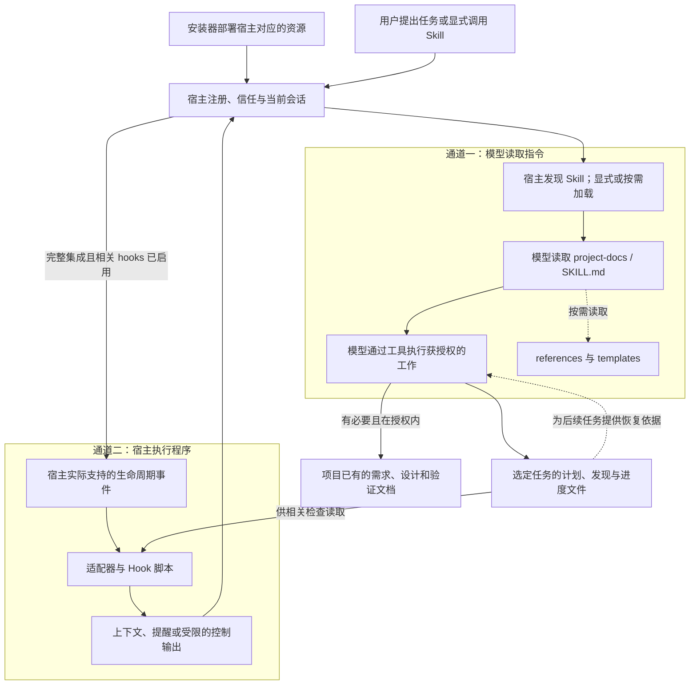
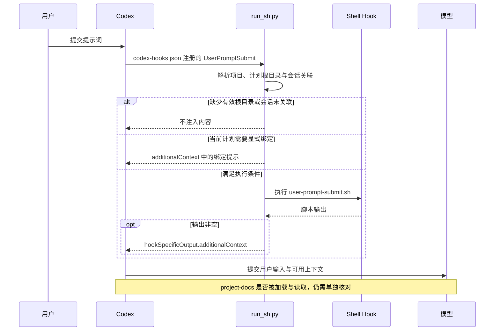
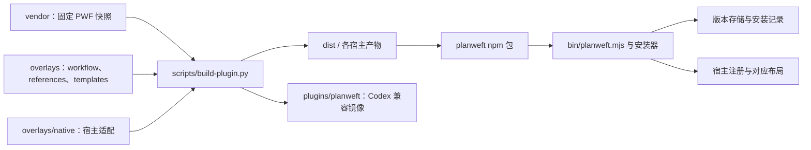

# PlanWeft 仓库展示与 README 改版建议

研究日期：2026-09-14<br>
静态检查基线：`psiQAQ/planweft`，`master`，`42aa74e18d1b4a5a13edb12c84da29fbdae7efcf`，包版本 `0.5.1`。

## 结论与检查范围

建议把 README 从“产品用途 + 发布验证摘要”调整为“具体任务 + 可观察的执行过程 + 清晰的控制边界”。核心不是把所有工程资料搬到首页，而是让读者沿着一条完整的路径理解：安装产生什么、宿主如何加载、模型读了什么、脚本何时运行、项目里留下什么、怎样确认生效。

本报告检查了根 README、安装与平台指南、开发约定、构建约定、完整工作流、安装器关键实现、Codex manifest / hook 配置与桥接代码、文档交接检查器、公开文档测试。没有运行真实宿主安装或模型任务，没有修改或提交仓库。Mermaid 源码已整理，但本次没有运行渲染器验证。以下目录树是从源码还原的布局；示例任务与验收标准是建议，不是本次实测结果。

## 1. 当前展示的具体缺口

| 问题 | 已检查的现状 | 建议 |
|---|---|---|
| 当前安装版本与首页不一致 | 根 README 和 package.json 为 0.5.1；安装指南仍以 0.4.0 为例 | 修改安装指南的规范源并重建；历史证据继续保留其真实版本 |
| 介绍了文件用途，但缺少一次完整任务 | 首页介绍 task_plan、findings、progress，未展示真实内容怎样变化 | 增加一个“修复—验证—中断—新会话接续”示例 |
| 缺少可理解的生效模型 | 功能分散于 Skill、manifest、宿主适配器、hooks 与脚本 | 解释“模型读取指令”和“宿主执行程序”两条通道 |
| 安装目录与任务目录不直观 | 指南有零散路径，首页没有前后目录图 | 分别画安装器数据、宿主注册与缓存、项目任务文档 |
| 支持声明容易跨版本误读 | platforms 页主要展示绑定 0.4.0 的证据；README 提醒不能外推至 0.5.x | 把当前可用性、实际入口、验证版本、已知限制分列 |
| 工程边界过早占据阅读注意力 | 首次读者很快遇到 attestation、gated、block 预算、promotion 记录 | 保留边界，但先给任务和输出；深层细节链接到参考资料 |
| 缺少“正常生效”的观察路径 | doctor 与实际 Skill 读取的区别已写，但不够醒目 | 把安装、发现、加载、信任、读取、任务产物列为独立检查 |
| 缺少文件级因果索引 | 文件在目录中，并不能解释谁会读取或执行它 | 新增 runtime-map，用角色与调用关系组织文件，而非文件名堆砌 |

依据：[P1][P2][P3][P4][P5][P6][P7][P13]。

特别注意：修复版本漂移，不等于把历史 0.4.0 验收结果改写为 0.5.1。验证结论必须保持原始版本、产物与环境绑定。[P3]

## 2. 外部项目：借鉴展示方式，不把 Star 当作正确性证明

Star 为研究日 GitHub 页面显示的约数，仅用于筛选案例；以下不是全网完整排行榜。Spec Kit、OpenSpec、Rulesync 属于相邻工具类别，不与原生插件做简单能力排名。

| 项目 | Star 约数 | 值得参考的位置 | 对 PlanWeft 的具体启发 |
|---|---:|---|---|
| obra/superpowers | 286.2k | How it works、The Basic Workflow | 先按任务时间线说明 Agent 行为，再列 Skills；不要照搬绝对自动执行承诺 |
| github/spec-kit | 136.5k | 按开发、修复、评估任务组织的入门路径 | 按用户要完成的工作提供配方，而不是先要求用户学完内部术语 |
| thedotmack/claude-mem | 93.8k | Architecture Overview、Data Flow、Session Lifecycle、Directory Structure | 让每类文件、组件、事件、输入输出可以相互对应；不照搬其数据库/服务架构 |
| Fission-AI/OpenSpec | 68.2k | See it in action、实际 spec 内容、自用文档链接 | 展示“用户输入—Agent 行为—落盘文件—内容片段—下一步” |
| Yeachan-Heo/oh-my-claudecode | 39.1k | CLI Commands vs In-Session Skills | 把终端命令与会话内 Skill 调用明确分开，避免安装命令被误当作工作流入口 |
| OthmanAdi/planning-with-files | 26.9k | 问题说明、三文件布局、不同安装路径 | 保持核心概念小而清楚，并说明 PlanWeft 在固定上游之外增加什么 |
| dyoshikawa/rulesync | 1.4k | 按能力维度区分的支持矩阵 | 用 scope、Skills、hooks、命令、权限等维度替代一个笼统的 Supported 勾号 |

依据：[E1]—[E8]。Claude-Mem 当前仓库出现 Grok Mem 品牌说明，表中沿用仓库名；这里研究其文档组织，不作产品部署推荐。

最贴切的用户反馈来自 OpenSpec Discussion #1024：读者指出演示只显示创建了 specs 目录，却没有说明文件实际长什么样。项目随后补充需求与场景的 Markdown 片段，并链接自己的真实 specs 与进行中的变更。这支持一个直接的改版要求：不要只展示文件名，还要展示读者应当审阅的内容。[E9]

## 3. 首页建议结构

首页承担“理解、判断、开始”的职责，不承担全部接口参考和发布历史。

```text
一句话定位与短说明
一个真实任务演示
安装与首次生效检查
它如何影响 Agent（两条通道）
安装后与运行后的文件分别在哪里
何时适用、何时不应增加文档
宿主入口、支持边界与控制方式
使用指南、原理、参考资料、开发资料导航
```

推荐的首屏文案草案：

> # PlanWeft
> 让编程任务在会话结束后，仍有可读、可接续、可核验的项目记录。
>
> PlanWeft 为已有的编程 Agent 提供持久化任务规划与文档交接工作流。复杂实现任务使用计划、发现和进度文件记录当前状态；必要时更新项目已有的需求、设计与验证文档。新会话可以从项目文件接续，而不只依赖聊天摘要。
>
> Skill 指导模型怎样维护记录，宿主 hooks 在支持的时点提供上下文或检查状态。默认模式提供提醒，不自动证明任务已完成。

这段文案依据现有工作流整理，不增加产品承诺。[P1][P6]

首页先显示当前版本、Node 要求、一个推荐入口即可。完整发布记录、准确归档摘要与历史验收链接应保留，但不应抢占首个使用示例的位置。

## 4. 通用 Agent 生效模型

“通用”应当是角色通用，不是所有宿主具备相同事件、目录、权限或自动续跑能力。

| 角色 | 含义 | 常见误解 |
|---|---|---|
| 宿主 | Codex、Claude Code、Pi 等实际运行模型和工具的程序 | 插件自身就是一个新的 Agent |
| Skill | 模型按需要读取的工作指令与资源入口 | Markdown 文件被当作确定性程序自动执行 |
| Hook | 宿主在某个事件时点调用的程序 | Hook 一定经过模型同意才会运行 |
| 适配器 | 翻译宿主事件、输入输出协议与路径的桥接代码 | 所有宿主共用完全相同的 hook 配置 |
| 项目工作记录 | 当前任务的计划、发现、操作与验证记录 | 安装器的 installations.json 也是任务状态 |
| 稳定项目文档 | 有持续价值的需求、设计决定、复现材料 | 每次修改都必须新增 specs、ADR 和 reproduction |

Agent Skills 标准描述的是发现、激活与按需执行/读取资源；PlanWeft 的实际加载和事件处理还要结合本地适配器。[E10][P6]

### 图 1：README 的通用生效图



图例与边界：虚线表示按需读取，不表示所有内容每轮都加载；图中的两条通道不是每轮都同时执行。Skill-only 不注册完整插件 hooks。现有文档交接检查器只检查状态，不负责决定和改写长期文档。其他运行时 hooks 可能维护自己的状态，不应把“交接检查只读”扩大为“全部 hooks 从不写文件”。[P2][P6][P11]

### 图 2：Codex 的已核对调用链

以下是 UserPromptSubmit 的静态控制路径，不是实际运行 trace。它独立于模型是否真的读取主 Skill。[P9][P10]



不要把“读取 hooks.json”“Shell 程序运行”“模型读取 SKILL.md”画成同一个动作，也不要画出一个未被源码支持的“Hook 自动读取完整 Skill”步骤。

### 图 3：供开发者阅读的构建与分发图



关键事实：workflow.md 在构建时插入生成后的主 SKILL.md，不是一个额外的运行时监听文件；根 README 不是运行时依赖；dist 与兼容镜像不应手工修改。[P4][P5]

## 5. 文件与脚本的行为对照表

建议建立 `docs/reference/runtime-map.md`。首页只展示概览，参考页覆盖每个发布入口及其可达脚本。不能只写“scripts：工具脚本”。每项至少有：规范源、发布路径、谁调用、触发时机、输入、读取范围、写入范围、返回值、默认/可选、失败表现、测试依据。

以下是已经核对的主链路示例，而非全仓每个辅助函数的运行时审计。

| 文件或资源 | 谁在何时使用 | 对行为的影响 | 应说明的边界 |
|---|---|---|---|
| `bin/planweft.mjs` / `lib/installer.mjs` | 用户运行 add/update/remove/doctor 时 | 安装对应宿主资源、调用原生注册、管理受管文件 | 不是会话中的任务执行器 |
| `overlays/planweft/workflow.md` | 构建器 | 插入主 SKILL 正文，规定任务授权、文档维护与交接规则 | 模型不会仅因源码目录存在而单独读取它 |
| 安装后的主 `SKILL.md` | 宿主选中后，由模型读取 | 指导模型发现项目入口、维护任务和必要文档 | 指令依从不是硬安全隔离 |
| `references/*.md` | 模型在相关任务中按需读取 | 补充证据、Documentation Map、显式控制等规则 | 不应声称每轮全部加载 |
| `templates/*` 与 `scripts/init-session.*` | 工作流需要初始化时，由模型通过工具使用 | 初始化/补充任务记录 | 普通初始化使用内嵌紧凑记录，并非直接复制所有普通模板文件 |
| `.codex-plugin/plugin.json` | Codex 原生发现机制 | 指向 skills 与 hooks 入口 | manifest 存在不代表当前会话已加载并信任 |
| `hooks/codex-hooks.json` | Codex 事件机制 | 定义事件、匹配条件与执行命令 | 事件注册不等于该能力的跨版本验收通过 |
| `.codex/hooks/run_sh.py` | SessionStart/UserPromptSubmit/PreCompact 的桥接入口 | 检查计划/会话关联，执行脚本，包装宿主协议输出 | 没有有效关联时可能不注入内容 |
| `document-handoff-check.sh` | 打包 hooks 的交接检查路径 | 读取选定计划，分类 pending/not_required/complete | 不修改文档，不判断文档内容是否正确 |
| `pw-*` / `pw_*` 辅助入口 | 用户明确请求相关操作时 | 提供兼容、诊断与显式控制 | 不是每个普通任务都需手动操作的必经步骤 |
| 项目 `task_plan.md` | 模型及相关运行时检查 | 当前任务的唯一动态状态来源 | 不与 findings、progress、Documentation Map 并列维护多个“当前状态” |
| 项目 `findings.md` / `progress.md` | 模型 | 分别记录发现与执行证据 | 不复制全部聊天历史；不能把 Not Run 写成 Passed |
| `installations.json` | 安装器 | 保存安装版本、scope、所有权及注册记录 | 不是 Agent 的任务记忆文件 |

依据：[P2][P5][P6][P7][P8][P9][P10][P11][P12]。

对“每个文件都有说明”的覆盖标准建议是：发布 manifest 中每个可执行入口都有对应记录；每个可达脚本都有说明或被标为内部库；模板/参考资料注明其消费者；构建专用、测试专用、历史资料明确标为非运行时入口。不需要把 vendored 库的每个内部函数搬进用户文档。

## 6. 安装后的文件结构

### 6.1 Codex 全局安装：安装器拥有的目录

下图以 POSIX 默认数据路径为例，依据当前安装器源码简化；不是本次实际安装截图。`PLANWEFT_HOME`、XDG 设置或 Windows 平台会改变数据根目录。[P2][P7][P12]

```text
~/.local/share/planweft/
├── installations.json                 # 宿主、版本、scope、受管项与注册记录
├── versions/
│   └── 0.5.1/
│       ├── receipt.json               # 版本与完整性凭据
│       ├── package-lock.json
│       └── node_modules/
│           └── planweft/              # 准确版本的 npm 包与各宿主产物
└── registries/
    └── codex/
        ├── .agents/plugins/marketplace.json
        └── payload/                   # 复制出的自包含 Codex 分发目录
            ├── .codex-plugin/plugin.json
            ├── hooks/codex-hooks.json
            ├── .codex/hooks/          # Python / Shell 适配入口等
            └── skills/project-docs/  # 主 Skill 与随附资源
```

Codex 还会通过自身机制维护原生注册和可能的缓存。不要把上述 payload 目录统一标为宿主最终执行目录；实际加载根目录要结合宿主的注册结果与运行环境核对。完整原生插件的 payload 是复制形成的自包含目录，不能因为安装器支持 `--symlink` 就把所有宿主安装都画为链接。[P7][P12]

### 6.2 OpenCode 项目安装：另一个更容易理解的例子

```text
your-project/
├── .planweft/
│   ├── installations.json
│   └── versions/<version>/...
└── .opencode/
    ├── plugins/planweft.ts             # 生成的入口，引用版本存储中的编译产物
    ├── skills/project-docs/            # 对应 Skill 的链接或受管副本
    └── commands/*.md                   # 分发包中的对应命令资源
```

这是当前安装器对 OpenCode 完整集成的显式部署方式。不要据此推断所有宿主都有 `.opencode` 式结构。[P7]

### 6.3 项目运行时产物：与插件安装分开

```text
your-project/
├── <选定的任务目录>/
│   ├── task_plan.md                    # 当前目标、阶段、阻塞与下一步
│   ├── findings.md                     # 发现、来源、假设
│   └── progress.md                     # 操作、错误、验证证据
└── <项目已有的文档位置>/
    ├── <相关需求文档>
    ├── <必要的设计决定>
    └── <复现或验证记录>
```

这是一组文档角色，不是强制新建的目录脚手架。任务目录遵循现有计划选择规则，可能复用已有计划或符合条件的旧根目录。长期文档按已有约定维护；没有必要就不新建。安装本身不等于自动初始化所有项目的任务记录。[P6]

文档旁边应有所有权说明：安装器管理的文件不要随意修改；用户自有的任务记录和稳定文档可以审阅与维护；卸载不删除项目记录，保留版本缓存也不代表插件仍在原生宿主中启用。[P2][P12]

## 7. 应补充的实际使用演示

### 7.1 演示任务：修复后中断，再从新会话接续

以下是演示制作脚本与预期检查点，不是本次实测日志。

终端：

```bash
npx planweft@0.5.1 add -a codex --global
npx planweft@0.5.1 doctor -a codex --global
```

创建新会话，在项目中输入：

```text
$project-docs
修复 CSV 导入时空行导致的崩溃，补回归测试，并更新受影响的使用说明。
保留现有文档目录。记录实际验证结果和未完成事项。
```

README 的演示不必放完整对话，应保留以下可观察节点：

| 节点 | 应展示的材料 | 能证明什么 |
|---|---|---|
| Skill 读取 | 工具轨迹或宿主提供的可观察记录 | 主 Skill 确实被读取，而不是模型口头声称启用 |
| 计划选择/初始化 | 选定目录与相关 diff | 任务状态位置清楚，没有重复状态源 |
| 调查与修复 | findings 片段、代码 diff | 记录了原因与修改，而非泛泛的计划 |
| 验证 | 实际命令、输出及 progress 片段 | 区分 Passed/Failed/Not Run；不能只靠完成复选框 |
| 文档交接 | 受影响文档 diff 与 handoff 段 | 说明考虑了哪些文档、实际处理结果和后续动作 |
| 新会话接续 | 不提供旧聊天，要求只读恢复状态 | 检查文件本身是否足够支持交接 |

新会话的检查提示词：

```text
$project-docs
请只读检查这个项目和已有任务文件，不修改任何文件。
说明当前目标、已经完成的工作、尚未解决的问题、可核验的测试证据，以及下一步。
```

纯只读演示还应通过宿主控制关闭相关执行 hooks，或使用已验证路径的 `PLANNING_DISABLED=1` 启动会话；不要只凭自然语言指令承诺所有 hooks 都不写入。[P2][P6]

### 7.2 展示一段真实会落盘的内容

首页需要短的 task_plan/progress 片段。下例只用于展示 handoff 的合法格式，不表示已完成任何验证：

```markdown
## Documentation Handoff
<!-- planweft-docs-status: pending -->
- Documents considered: 项目现有的 CSV 导入使用说明。
- Rationale / evidence: 需核对空行处理规则；尚未完成文档更新与回归验证。
- Next action: 更新对应说明并执行回归测试；记录实际结果后再调整交接状态。
```

格式要与真实解析器一致：标题、marker、英文键名是协议，值可以使用中文。pending、not_required、complete 是文档交接判定，不是人工批准或代码正确性证明。[P6][P11]

### 7.3 另两个短案例

| 场景 | 展示重点 | 不应展示为产品能力的内容 |
|---|---|---|
| 接手有现成文档的旧项目 | 复用已有入口、计划和设计，不强制迁移目录 | 自动全仓扫描、自动生成整套文档导航 |
| 只分析原因，不实施修改 | 不新增任务记录、不改文档，并明确宿主 hooks 控制 | 模型理解只读就自动阻止所有先于 Skill 的 hooks |

先制作一个有真实产物与验证的完整案例，再扩展场景，不要用大量未执行的虚构成功对话充数。

## 8. 首次生效、支持矩阵与故障定位

### 8.1 首次生效不是单一的绿色勾号

```text
安装记录存在
  → 宿主发现对应注册
  → 当前会话已加载更新后的资源
  → 相关 hooks 已获宿主信任并启用
  → 模型实际读取主 Skill
  → 授权任务出现预期文档产物
  → 新会话能从这些文件恢复正确状态
```

这是检查清单，不是每步由前一步自动保证的执行链。doctor 主要检查受管安装记录、完整性、重复来源与安装状态；不能代替模型读取和实际工作流验证。[P2][P7][P12]

### 8.2 各宿主的最小入口表

| 宿主 | 安装 scope 要点 | 会话内入口或检查 |
|---|---|---|
| Codex | 完整集成须 global | `$project-docs`；另核对 hooks 信任与当前定义 |
| Claude Code | 按项目/用户 scope 安装 | `/planweft:project-docs` |
| Pi | 按项目/用户 scope 安装 | `/skill:project-docs`；执行循环需显式相关操作 |
| OpenCode V1 | 独立 Skill 与插件配对 | `project-docs`，以及需要时的 `pw_init`、`pw_status`、`pw_check` |
| DSH | 完整集成须 global 且绑定 profile | 所选 profile 的新会话中显式使用 `project-docs` |

依据安装指南与安装器；这不是 0.5.1 的五宿主实测通过表。[P2][P7][P12]

建议平台支持页分别记录：宿主版本、插件版本、完整/Skill-only、scope、Skill 入口、上下文提醒、默认行为、显式 gated/续跑、卸载保护、实测状态与证据链接。历史 0.4.0 结果原样保留，不通过修改表头升级为当前版本。[P3]

### 8.3 面向用户的故障表

| 现象 | 应先查的层次 | 不应直接归因 |
|---|---|---|
| 安装成功，但 Skill 不可见 | 宿主注册、scope、发现路径 | 先怪模型不遵循指令 |
| 新版本仍是旧行为 | 原生资源刷新、当前进程重载/新会话 | 仅凭版本存储目录已经更新 |
| Skill 可见却无文档变化 | 是否实际读取、任务是否需要文档、是否有授权 | 没有新文件就说明插件失效 |
| 没有 Hook 提示 | 信任、事件支持、计划选择、会话关联、禁用设置 | 只要 hooks.json 存在就应触发 |
| doctor 报冲突 | 真实注册 ID 与另一套规划来源 | 强制删除未知缓存或用户修改 |
| 卸载后文档仍在 | 文件所有权与保留策略 | 把用户记录当残留垃圾 |

这部分可先扩充现有安装指南的 FAQ，不必立即新增一个内容重复的 troubleshooting 页面。[P2][P7][P10][P12]

## 9. 开发使用者关心的问题，应在文档中直接回答

| 关注点 | 应给出的答案或材料 |
|---|---|
| 是否侵入我的项目 | 哪些任务才初始化；哪些目录仅在必要时创建；已有路径如何复用 |
| 能否控制自动行为 | 默认 advisory；关闭方式；哪些能力需要显式启用；何时可能阻止结束 |
| Skill 与 hooks 谁负责什么 | 模型负责授权文档决策/编辑；交接 checker 分类状态；宿主负责权限与事件执行 |
| 我能不能自己改这些文件 | 用户项目文档与安装器受管文件的所有权矩阵；更新前冲突保护 |
| 与已有 PWF/规划插件能否共存 | 一套会话只启用一套规划执行 hooks；可检测冲突范围与人工处理方法 |
| 与 Superpowers/OpenSpec 的关系 | 列出职责交集和待验证组合，不简单宣称全面替代或绝对兼容 |
| 文件越来越长怎么办 | 工作状态与历史证据的职责区分；当前实现并非自动压缩/自动迁移归档系统；长期任务给出真实增长案例 |
| 多 Agent 同时修改怎么办 | 单计划所有者与工作分配规则；advisory 并行保护不是文件锁或冲突合并器 |
| 安装和运行是否联网 | 安装阶段的包下载与宿主/模型通信分开说明；本地存储不等于宿主不会把上下文发送给模型 |
| 额外消耗多少上下文 | 分别记录元数据、完整 Skill、按需 references、hooks 注入的规模与频率；没有实测就不要宣称节约百分比 |
| 卸载/回滚意味着什么 | 插件代码版本变化不回滚已经修改的项目代码或任务文档 |
| 怎样确认实现正确 | 文档门禁、文件摘要、计划完成状态不能代替代码测试与需求验收 |

依据现有边界与工作流：[P1][P2][P3][P6][P8][P11][P12]。表中要求提供的增长/开销报告是建议新增的展示证据，不表示仓库已经实现了相应自动管理功能。

## 10. 文档信息架构与展示载体

文档分类可借鉴 Diátaxis 的教程、操作指南、解释、参考资料四类，但应复用现有文件，避免为了分类重新搭建庞大层级。[E11]

建议的最小新增集合：

```text
README.md / README.en.md                # 首页：价值、任务示例、入门、导航
# 以下 existing 表示已经存在；new 表示改版建议

docs/
├── installation*.md                    # existing：安装与管理操作
├── platforms*.md                       # existing：支持边界与分版本证据
├── how-it-works*.md                     # new：用户可理解的生效机制与目录
├── reference/runtime-map*.md            # new：入口、脚本、输入输出与测试映射
└── development.md                      # existing：维护者源文件与构建约定

examples/
└── bugfix-and-resume/                   # new：先只做一个完整、真实案例
    ├── README.md                       # 操作步骤、版本、权限与验证范围
    ├── before/                         # 最小起始项目
    ├── after/                          # 脱敏后实际产物；声明是否包含运行结果
    └── evidence/                       # 可复现命令与最小必要记录
```

README 和案例尽量包含纯文本演示，即使图片加载失败或读者在终端阅读，也能理解。视频/GIF 可以补充，但不要代替文字与可检查产物。Mermaid 图应有标题、范围、节点含义，默认用户图与开发细节图分离。GitHub 支持 fenced Mermaid 图；应验证 GitHub 使用的语法能力，并避免依赖最新 Mermaid 特性的复杂图。[E12]

网站不是第一优先级。先让仓库和 npm 包里的入口文档准确、自包含，再由同一规范源发布文档站，避免独立维护第三套版本说明。首页只保留少量有助于判断的徽章：版本、文档/构建检查、许可证；Star 图、赞助信息与完整发布履历不应挤掉实际使用介绍。

## 11. 改版实施顺序与验收目标

以下是建议的交付阶段与目标，不是已经执行的测试。

| 阶段 | 交付内容 | 可衡量验收 |
|---|---|---|
| P0：首个文档 PR | 修正当前安装命令；首屏定位；一个任务片段；通用机制图；安装/任务两类目录图 | 当前安装示例版本与 package.json 一致；历史结果不被改写；图中不存在“Hook 自动修改长期文档”的错误箭头 |
| P1：下一次文档发布前 | 一个真实修复与接续案例；how-it-works；五宿主入口；runtime-map | 案例可从最小项目重复执行；每个已发布可执行入口均能找到输入/输出/读写范围说明；模型验证单独记录 |
| P2：后续维护 | 文档防漂移检查、目录快照、Mermaid 检查、上下文开销样本 | 当前安装命令版本覆盖检查；内部路径/锚点验证；Mermaid 编译；规范源与生成产物一致；没有数据的性能项保持未测 |

建议做一次读者测试：找 3–5 位未参与项目开发的使用者，在不阅读工程 specs 的情况下，让他们在 60 秒内说明项目用途，在 5 分钟内定位自己的安装与调用方式。随后要求他们正确区分 Skill 与 Hook、找到任务文件、解释卸载保留哪些内容。以上是建议目标，不是当前成绩。

### 11.1 必须修改正确的规范源

| 内容 | 应修改的位置 | 不能直接修改的位置 |
|---|---|---|
| 根仓库首页 | 根 `README.md` 与 `README.en.md` | 不应靠改包内 README 代替首页 |
| 各分发包的介绍 | `overlays/planweft/README*.md` | `dist/**/README*` |
| 安装指南 | `overlays/planweft/install/INSTALL*.md` | 生成的 `docs/installation*.md` 和 `dist/**/INSTALL*` |
| 用户原理/参考页 | 新增或扩展 `docs/` 对应规范文档 | 不应误当 runtime 资源自动注入模型 |
| 文档一致性测试 | `tests/test_public_docs.py` 与所需独立检查 | 不通过改历史证据来让测试通过 |

依据：[P4][P5][P13]。

当前 `tests/test_public_docs.py` 检查双语导航、相对目标文件存在、安装指南代码块一致以及生成包的文档配对。它没有当前安装版本与 package.json 一致性校验，也没有 Mermaid 渲染或链接锚点存在性检查。其 `commands()` 实际提取所有 fenced code blocks，若未来在安装指南加入中英不同的图示，需区分“可执行命令块”和“说明图示块”，或把图移到原理页。[P13]

新增 README 中的相对链接与示例资源时，还要检查 package.json 的 files 白名单。npm 包不会自动包含所有新 docs/assets/examples；必须选择把相关资源纳入包，或在包内文档中使用可访问的已发布链接，避免 GitHub 上正常、npm 安装后断链。[P8]

仓库已有验证入口如下，实际改版后执行并记录结果；本报告没有执行它们：

```bash
python3 scripts/build-plugin.py --verify
python3 -m unittest tests.test_public_docs
npm run check
python3 -m unittest discover -s tests -p 'test_*.py'
git diff --check
```

### 11.2 可交给本地 Agent 的实施任务简报

目标：改进 PlanWeft 对开发使用者的展示，优先澄清具体使用、生效链路、安装后结构和用户控制；不增加运行时功能，不改变宿主协议。

成功标准：完成 P0 与 P1 文档项；至少一个实际验证的案例；所有当前安装命令版本准确；历史验收保持真实绑定；新增图和文件说明不扩大能力承诺。

约束：基于当前工作区重新确认分支和版本，保留已有修改；修改规范源而非 generated 文件；不更新固定上游、依赖或宿主协议来完成纯文档工作；不把实验性能力升格为正式支持；不伪造截图、日志、测试通过或新会话读取证据。

步骤：先建立用户阅读路径和事实映射；修复版本漂移；补任务示例、目录图与 Mermaid；建立按入口分类的 runtime-map；执行现有测试与新增文档检查；最后做一次不提供原聊天的独立读者检查。

完成报告：分别报告已改内容、静态检查、实际宿主与模型验证、未执行项及原因。案例没有跑通时保留准确状态，不用模型自述代替证据。

## 12. 来源索引

### PlanWeft：固定版本源码与文档

以下均固定到本报告检查的提交，避免后续 master 更新改变证据。

[P1]: https://github.com/psiQAQ/planweft/blob/42aa74e18d1b4a5a13edb12c84da29fbdae7efcf/README.md
[P2]: https://github.com/psiQAQ/planweft/blob/42aa74e18d1b4a5a13edb12c84da29fbdae7efcf/docs/installation.md
[P3]: https://github.com/psiQAQ/planweft/blob/42aa74e18d1b4a5a13edb12c84da29fbdae7efcf/docs/platforms.md
[P4]: https://github.com/psiQAQ/planweft/blob/42aa74e18d1b4a5a13edb12c84da29fbdae7efcf/docs/development.md
[P5]: https://github.com/psiQAQ/planweft/blob/42aa74e18d1b4a5a13edb12c84da29fbdae7efcf/overlays/planweft/BUILD.md
[P6]: https://github.com/psiQAQ/planweft/blob/42aa74e18d1b4a5a13edb12c84da29fbdae7efcf/overlays/planweft/workflow.md
[P7]: https://github.com/psiQAQ/planweft/blob/42aa74e18d1b4a5a13edb12c84da29fbdae7efcf/lib/installer.mjs
[P8]: https://github.com/psiQAQ/planweft/blob/42aa74e18d1b4a5a13edb12c84da29fbdae7efcf/package.json
[P9]: https://github.com/psiQAQ/planweft/blob/42aa74e18d1b4a5a13edb12c84da29fbdae7efcf/dist/codex/planweft/hooks/codex-hooks.json
[P10]: https://github.com/psiQAQ/planweft/blob/42aa74e18d1b4a5a13edb12c84da29fbdae7efcf/dist/codex/planweft/.codex/hooks/run_sh.py
[P11]: https://github.com/psiQAQ/planweft/blob/42aa74e18d1b4a5a13edb12c84da29fbdae7efcf/overlays/planweft/document-handoff-check.sh
[P12]: https://github.com/psiQAQ/planweft/blob/42aa74e18d1b4a5a13edb12c84da29fbdae7efcf/lib/installer.mjs#L301-L580
[P13]: https://github.com/psiQAQ/planweft/blob/42aa74e18d1b4a5a13edb12c84da29fbdae7efcf/tests/test_public_docs.py

### 外部项目与文档

[E1]: https://github.com/obra/superpowers
[E2]: https://github.com/github/spec-kit
[E3]: https://github.com/thedotmack/claude-mem
[E4]: https://docs.claude-mem.ai/architecture/overview
[E5]: https://github.com/Fission-AI/OpenSpec
[E6]: https://github.com/Yeachan-Heo/oh-my-claudecode
[E7]: https://github.com/OthmanAdi/planning-with-files
[E8]: https://github.com/dyoshikawa/rulesync
[E9]: https://github.com/Fission-AI/OpenSpec/discussions/1024
[E10]: https://agentskills.io/home
[E11]: https://diataxis.fr/
[E12]: https://docs.github.com/en/get-started/writing-on-github/working-with-advanced-formatting/creating-diagrams
