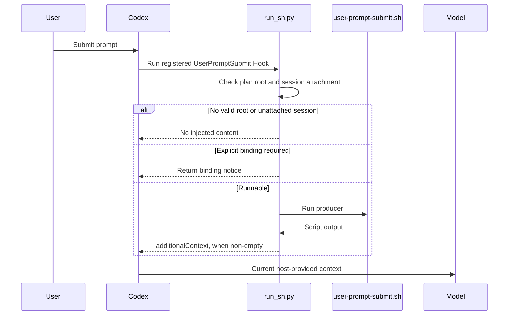

[简体中文](runtime-map.md) | [English](runtime-map.en.md)

# PlanWeft runtime resources and invocation boundaries

This page answers which file affects what and when. It covers public entry points and the main invocation paths; it is not a full runtime audit of every fixed-upstream or internal helper function. Paths come from current source and package layout. Whether a current host or model actually loaded them must be checked separately using [how it works](../how-it-works.en.md).

| Resource or path | Who uses it and when | Actual effect | Important boundary |
| --- | --- | --- | --- |
| `bin/planweft.mjs` and `lib/installer.mjs` | When a user runs `add`, `update`, `remove`, `list`, or `doctor` | Deploys host resources, calls native registration, maintains managed installation records | Not a task executor in a session |
| `overlays/planweft/workflow.md` | When the builder generates the main Skill | Inserts local document-maintenance and handoff rules into the generated `project-docs` Skill | A build source; the model does not read it merely because the source directory exists |
| Installed `skills/project-docs/SKILL.md` | When the host selects the Skill and the model reads it | Guides project discovery, task records, document maintenance, and handoff | Instructions are not a hard security boundary and do not prove the current session read them |
| `references/*.md` | On-demand when the model needs them for a relevant task | Adds rules for evidence, documentation maps, and explicit controls | Do not claim that every reference is loaded on every turn |
| `templates/*` and `scripts/init-session.*` | When the workflow initializes or supplements records | Supplies record structure and initialization capability | Ordinary initialization uses embedded compact records; it does not unconditionally copy all Markdown templates |
| Host manifests and `hooks/*.json` | When a host discovers resources and registers events | Declares Skills, Hooks, events, and command entry points | Discovery or registration does not mean trusted, enabled, or accepted |
| Codex `hooks/codex-hooks.json` and `.codex/hooks/run_sh.py` | At Codex SessionStart, UserPromptSubmit, and PreCompact events | Checks plan root and session attachment, runs a producer, and wraps protocol output | No root or unattached session means no injection; this is a source path, not a live trace |
| `document-handoff-check.sh` | When a packaged Hook classifies the selected plan's handoff section | Returns `pending`, `not_required`, or `complete` | Read-only; does not write documents or judge implementation/document correctness |
| `pw-*` / `pw_*` helper entry points | When a user explicitly requests compatibility, diagnosis, or a control operation | Provides retained explicit operations | Not a manual prerequisite for ordinary work |
| Project `task_plan.md` | When the model and related checks read the current task | The one dynamic state source for that task | Do not create a competing state source in findings, progress, or a Documentation Map |
| Project `findings.md` and `progress.md` | When the model maintains investigation and execution evidence | Separately retain findings/sources and actual actions/validation results | Do not copy complete chats or turn Not Run into Passed |
| `installations.json` | When the installer reads or writes installation state | Stores version, scope, ownership, and registration records | Not agent task memory |

## Codex: a checked event path

In the Codex distribution, `UserPromptSubmit` calls `run_sh.py`. The bridge first checks for a valid plan root and session attachment; an invalid attachment produces no context, an explicitly required binding returns a notice, and otherwise it runs `user-prompt-submit.sh` and wraps non-empty output as `hookSpecificOutput.additionalContext`.

This explains why a prompt may receive no reminder, but it does not prove that the main Skill was read in any particular session. For host differences, formal support, and historical validation boundaries, see [platform support](../platforms.en.md).

## Ownership and fault isolation

- **A conflict in installer-owned resources:** use `doctor` to inspect managed state. Do not treat the installation directory as project task state or delete project records to repair registration.
- **A new session lacks expected context:** check host discovery/trust, plugin version, plan/session attachment, event support, and actual Skill reading separately; do not collapse them into one “enabled” conclusion.
- **A handoff remains pending:** check that the selected `task_plan.md` has exactly one complete `Documentation Handoff` section and a valid marker. That check does not replace actual documentation or code validation.
- **Strict read-only work is needed:** use a host-supported Hook control before starting the session. A host that cannot reliably identify intent should set `PLANNING_DISABLED=1` before startup; natural-language wording alone cannot undo a Hook that already ran.
