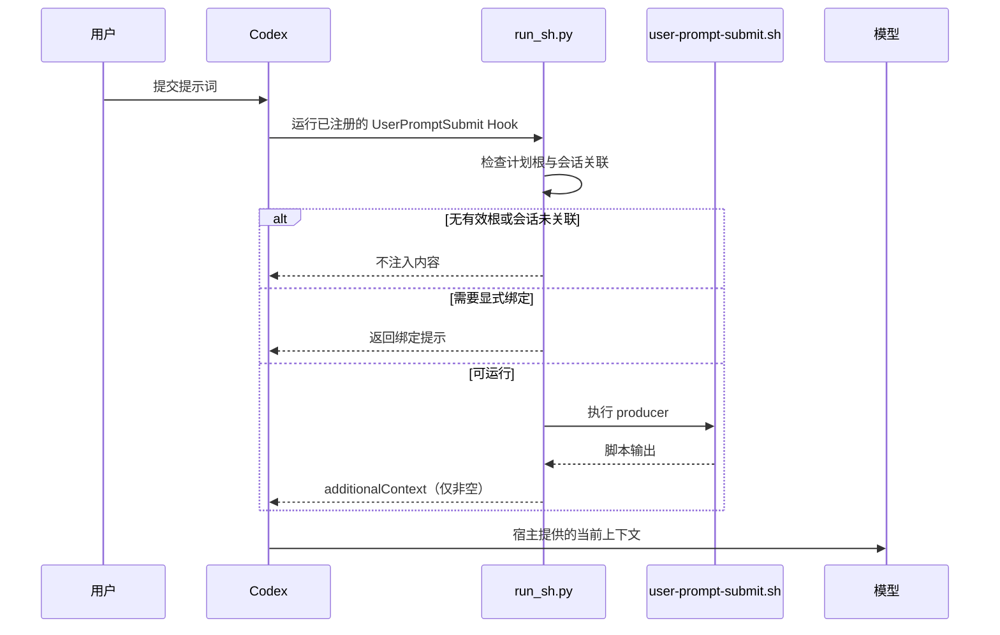

[简体中文](runtime-map.md) | [English](runtime-map.en.md)

# PlanWeft 运行时资源与调用边界

本页回答“哪个文件在何时影响什么”。它覆盖公开入口和主要调用链，不是对固定上游或每个内部辅助函数的完整运行时审计。路径来自当前源码与打包布局；是否被当前宿主或模型实际加载，需要按[工作原理](../how-it-works.md)中的独立检查项确认。

| 资源或路径 | 谁在何时使用 | 实际影响 | 重要边界 |
| --- | --- | --- | --- |
| `bin/planweft.mjs` 与 `lib/installer.mjs` | 用户运行 `add`、`update`、`remove`、`list` 或 `doctor` 时 | 部署宿主资源、调用原生注册、维护受管安装记录 | 不是会话中的任务执行器 |
| `overlays/planweft/workflow.md` | 构建器生成主 Skill 时 | 把本地文档维护与交接规则插入生成后的 `project-docs` Skill | 它是构建源，不会因源码目录存在而被模型单独读取 |
| 安装后的 `skills/project-docs/SKILL.md` | 宿主选中 Skill 后由模型读取 | 指导项目发现、任务记录、文档维护和交接 | 指令不构成硬安全隔离，也不证明当前会话已读取 |
| `references/*.md` | 模型仅在相应任务需要时按需读取 | 补充证据、文档职责映射和显式控制的规则 | 不应声称每轮都会加载全部参考资料 |
| `templates/*` 与 `scripts/init-session.*` | 工作流需要初始化或补充记录时 | 提供记录结构与初始化能力 | 普通初始化使用内嵌紧凑记录，不是无条件复制所有 Markdown 模板 |
| 宿主 manifest 与 `hooks/*.json` | 宿主发现资源、注册事件时 | 声明 Skill、Hook、事件和命令入口 | 被发现或注册不等于已信任、已启用或已验收 |
| Codex 的 `hooks/codex-hooks.json` 与 `.codex/hooks/run_sh.py` | Codex 的 SessionStart、UserPromptSubmit、PreCompact 事件 | 检查计划根目录和会话关联，执行 producer，再按宿主协议包装输出 | 无根目录或未关联会话不会注入；这是静态源码链路，不是 live trace |
| `document-handoff-check.sh` | 打包 Hook 需要分类选中计划的交接段时 | 返回 `pending`、`not_required` 或 `complete` | 只读；不写文档、不判断实现或文档正确性 |
| `pw-*` / `pw_*` 辅助入口 | 用户明确请求兼容、诊断或控制操作时 | 提供保留的显式操作界面 | 不是普通任务的必经手工步骤 |
| 项目 `task_plan.md` | 模型和相关检查读取当前任务时 | 当前任务的唯一动态状态来源 | 不与 findings、progress 或 Documentation Map 并列为第二状态源 |
| 项目 `findings.md` 与 `progress.md` | 模型维护调查与执行证据时 | 分别保存发现/来源和实际操作/验证结果 | 不复制完整聊天，也不能把 Not Run 写成 Passed |
| `installations.json` | 安装器读写安装状态时 | 保存版本、scope、所有权和注册记录 | 不是 Agent 的任务记忆 |

## Codex：一个已核对的事件链

`UserPromptSubmit` 在 Codex 分发中调用 `run_sh.py`。该桥接器先检查有效计划根目录和会话关联；关联无效时不输出上下文，需要显式绑定时返回绑定提示；否则执行 `user-prompt-submit.sh`，并把非空结果包装为 `hookSpecificOutput.additionalContext`。

这说明“为什么有时没有提示”，但不能证明主 Skill 已在任何具体会话被读取。完整宿主差异、正式支持和历史验证边界见[平台文档](../platforms.md)。

## 所有权与故障定位

- **安装器拥有的资源发生冲突：** 用 `doctor` 查看受管状态；不要把安装目录当成项目任务状态，或用删除项目记录的方式修复注册问题。
- **新会话没有预期上下文：** 分别检查宿主发现/信任、插件版本、会话与计划关联、事件支持和 Skill 实际读取，不把它们合并成一个“已启用”的结论。
- **交接仍为 pending：** 检查选中 `task_plan.md` 中是否只有一个完整的 `Documentation Handoff` 段和有效 marker；该检查不会代替实际文档或代码验证。
- **需要严格只读：** 在会话启动前使用宿主支持的 Hook 控制；无法可靠区分意图的宿主应在启动前设置 `PLANNING_DISABLED=1`。仅靠自然语言要求不能撤销已经触发的 Hook。
